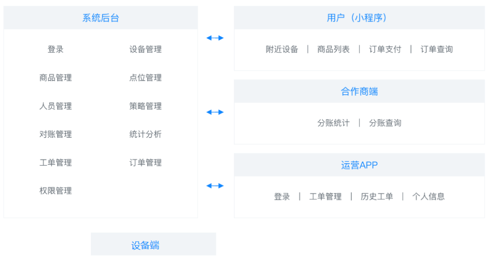
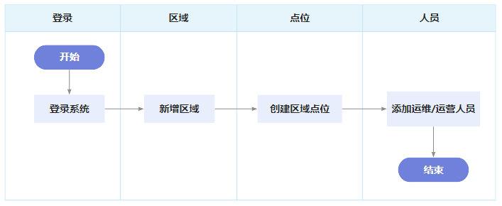
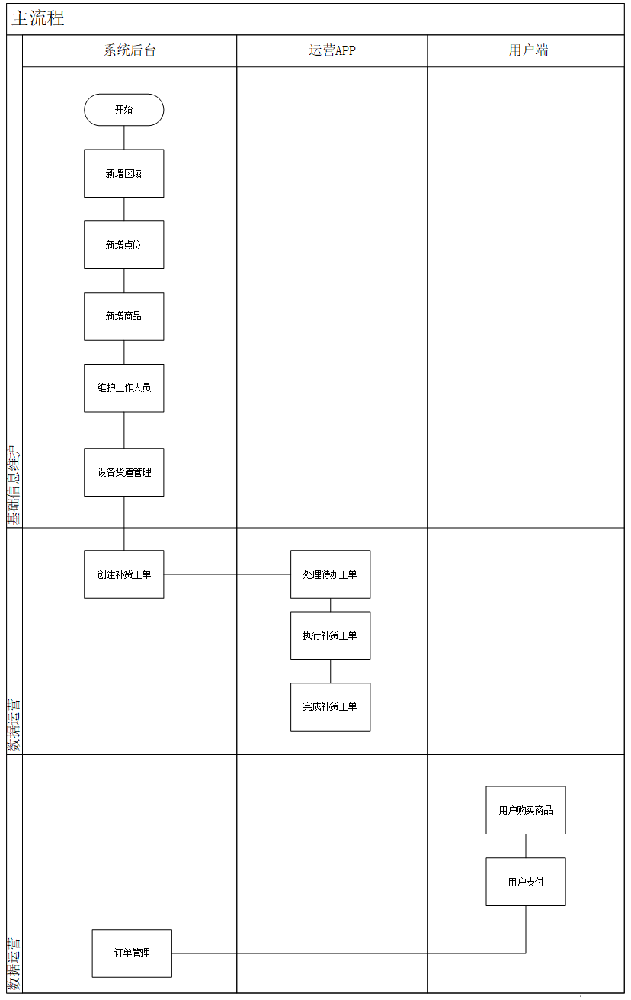

# 帝可得之项目介绍、AIGC、提示工程

帝可得是一个基于物联网概念下的智能售货机运营管理系统。

## 一、物联网

物联网（IoT：Internet of Things），简单来说就是让各种物品通过互联网连接起来，实现信息的交换和通信。

- 可以把它想象成一个超大的社交网络。
- 这个网络里的成员不是人类，而是各种物品。它们可以通过互联网互相交流信息
  - 比如，冰箱、洗衣机、汽车，

物联网的神奇之处，在于它能够让这些物品变得更加“聪明”。

它们能够感知周围的环境，并且能够根据情况，自动做出反应。

- 比如：在下班回家的路上，家里的空调提前开启，自动调整到适宜的温度，

物联网的应用场景：智能家居、共享充电中、智能售货机。

## 二、售货机

近年来，无接触式智能售货机，逐渐成为年轻消费者的首选购物方式。

这些设备在公园、地铁站和商场等公共场所广泛分布，为顾客提供了极大的购物便利，

由于其运营成本低廉和较高的利润空间，被众多电商企业视为新兴的蓝海市场。

与传统售货机相比，智能售货机的优势在于其自我管理能力，表现如下：

- **物联网技术**：不管售货机在哪，管理人员都能通过远程终端（电脑或手机）知道它的状态。
  - 比如：哪些商品快卖完了，哪些需要补货。
- **智能分析与推荐**：能分析顾客的喜好，找到用户最想要的东西，推荐商品。
- **人员设备绑定管理**：每个售货机都有自己的专属“保镖”，一旦售货机出现问题，这些“保镖”就能立刻出现，迅速解决问题，让售货机始终保持最佳状态。
- **移动支付**：支持各种移动支付方式，一扫即付，既方便又安全，让购物体验更加流畅。
- **线上线下融合（OMO）**：把线上和线下完美结合起来：顾客可以：
  - 在线上浏览商品，然后直接在售货机上购买；
  - 或者在售货机上看到喜欢的商品后，直接在线上下单。

### 2.1.售货机术语

**区域管理**： 为更高效地进行经营管理，基于业务需求，公司将运营范围划分为若干个逻辑区域。与地理上的行政区域有所区别，以确保更合理的资源分配和更高效的运营管理。


**点位选择**： 点位指的是智能售货机的具体放置位置。选择点位时，我们会考虑人流量、目标顾客群体、可见度以及便利性等因素，以最大化售货机的使用效率和顾客的购买体验。

**售货机功能**： 智能售货机就像是一个自动的小店，里面摆满了各种商品。顾客想要什么，直接在机器上选，然后机器就会把商品送到他们手中，就像是一个自动化的仓库。

**货道设计**：售货机里面的货道，可以想象成超市里的那种货架。每一层都有好几个位置可以放商品，这样就能放很多种不同的商品，而且每一层都能放很多，这样顾客的选择就会更多。

## 三、角色与功能

一个完整的售货机系统，由五端五角色组成：

1. 管理员：对基础数据（区域、点位、设备、货道、商品等）进行管理，创建工单指派运维或运营人员，查看订单，查看各种统计报表。

2. 运维人员：投放设备、撤除设备、维修设备。

3. 运营人员：补货。

4. 合作商：仅提供点位，坐收渔翁之利。
5. 消费者: 在小程序或屏幕端下单购买商品。



### 3.1.管理员

管理员业务流程如下图所示：




上图中的简要流程：

1. 平台管理人员登录到系统管理后台系统；
2. 创建区域数据；
3. 创建区域下点位数据；
4. 添加运维/运营人员；
5. 创建售货机信息；
6. 设置售货机点位信息；
7. 创建运维投放工单，由运维人员开始投放设备（安装设备）；
8. 设置售卖的商品信息；
9. 创建运营补货工单，由运营人员开始投放商品信息。

### 3.2.运维人员

运维人员业务流程如下图所示：


上图中的简要流程：

1. 运维人员通过 App 登录运营系统；
2. 在 App 对派送过来的工单进行处理；
3. 接受工单后在指定的投放点安装售货机；
4. 拒绝工单该运维人员的工单结束

### 3.3.运营人员

运营人员业务流程如下图所示：


上图中的简要流程：

1. 运营人员通过 App 登录运营系统
2. 在 App 对派送过来的工单进行处理
3. 接受工单后在指定的售货机的商品进行补货
4. 拒绝工单该运维人员的工单结束

### 3.4.消费者


上图中的简要流程：

方式一：

1. 用户通过售货机二维码进行购买商品；
2. 扫码后在手机端微信小程序选择商品；
3. 支付成功后在售货机取货。

方式二：

1. 用户在售货机上选择商品；
2. 在选择商品后扫码支付商品的二维码；
3. 支付成功后在售货机取货。

## 四、业务流程

整个工程，会对主要核心的业务进行实现，主要包含下面的业务流程：

1. **平台管理员**：主要作用有基础数据的管理，创建工单，派出员工完成维修或补货；
2. **运营人员**：主要作用是处理运营工单业务（补货等操作）；
3. **运维人员**：主要作用是处理运维工单业务（设备维修等操作）；
4. **消费者**：供 C 端用户使用。消费者扫描售货机上的二维码，可以打开此端。主要作用是完成在售货机的购物操作。



## 五、产品原型

帝可得项目[产品原型](https://codesign.qq.com/s/426304924036117)。

## 六、数据库设计

系统后台基础数据表关系说明：


- 一个区域可以有多个点位
- 一个点位可以有多个售货机
- 一个售货机有多个货道
- 多个货道可以放置同一样商品
- 一个商品类型下有多个商品
- 一个售货机类型下有多个售货机
- 一个合作商有多个点位
- 合作商和区域之间没有关系，因为合作商拥有的多个点位可以分布在不同的区域
- 每个区域下有多个运维和运营人员，他们来负责这个区域下的设备的运维和运营

## 七、AIGC

AI 即人工智能，是计算机科学体系下的一个学科，是指通过计算机系统模拟人类智力的一种技术。

它通过机器学习、深度学习等算法，使计算机具备对数据分析、理解、推理和决策的能力。

AIGC（AI Generated Content）：AIGC 是 AI 领域的一个应用分支，专注于利用 AI 技术自动生成内容，包括文本，代码，图片，音频，视频。

AI 大模型，通常指的是具有大量参数的深度学习模型，经过大量数据训练，具备复杂计算能力的人工智能系统，它们能够执行多种高级任务，其中包括内容生成。

## 八、提示工程

提示（Prompt）是我们对大模型提出的问题。

- 比如："你是谁？"，这个问题便是 prompt。

在与 AI 交流时，同一个问题使用不同的 prompt 可能会获得不同的答案；

为了调教出一个聪明的 AI 助手，就需要用到提示工程。

- 通过精心设计的提示，我们可以引导 AI 模型，让它的输出更加准确、相关和有用。

提示工程（Prompt Engineering）也被称为上下文提示，它涉及到设计和优化输入文本，也就是 Prompt，来引导 AI 模型生成预期的输出。

### 8.1.Prompt 的组成

- **角色**：给 AI 定义一个最匹配任务的角色；
  - 比如：「你是一位软件工程师」「你是一位小学老师」；
- **指示**：对任务进行描述；
- **上下文**：给出与任务相关的其它背景信息（尤其在多轮交互中）；
- **例子**：必要时给出举例，
  - [实践证明其对输出正确性有帮助]
- **输入**：任务的输入信息；在提示词中明确的标识出输入；
- **输出**：输出的格式描述，以便后继模块自动解析模型的输出结果；
  - 比如（JSON、Java）

### 8.2.Prompt 案例

案例一：

- 角色：你是一位专业的博客作者。
- 指示：撰写一篇关于最新 AI 技术发展的文章。
- 上下文：文章应该涵盖 AI 技术的当前状态和未来趋势。
- 例子：可以引用最近的 AI 技术突破和行业专家的见解。
- 输入：当前 AI 技术的相关信息和数据。
- 输出：一篇结构清晰、观点鲜明的文章草稿。

案例二：

- 角色：你是一位资深的 Java 开发工程师。
- 指示：编写一个 Java 函数，该函数接收两个整数参数，并返回它们的和。
- 上下文：这个函数将被用于一个简单的数学应用程序，该程序帮助学生练习基本的算术运算。
- 例子：如果你调用函数 `addNumbers(3, 5)`，它应该返回 `8`。
- 输入：两个整数参数，分别为 `int a` 和 `int b`。
- 输出：返回这两个整数的和，类型为 `int`。

### 8.3.Prompt 实践

#### 8.3.1.生成表结构

提示词：

```markdown
你是一个软件工程师，帮我生成 MySQL 的表结构
需求如下：
1，课程管理表，表名 tb_course，字段有主键 id、课程编码、课程学科、课程名称、课程价格、适用人群、课程介绍
其他要求：
1，每个表中都有创建时间(create_time)、修改时间(date_time)、创建人(create_by)、修改人(update_by)、备注(remark)这些字段
2，每个表的主键都是自增的
3，课程价格是整型、课程编码是字符串
4，请为每个字段都添加上 comment
5，帮我给生成的表中插入一些 IT 课程示例数据
课程学科：Java、人工智能、大数据
适用人群：小白学员、中级程序员
```

输出：

```mysql
-- 创建课程管理表 tb_course
CREATE TABLE tb_course (
    id INT AUTO_INCREMENT PRIMARY KEY COMMENT '主键，课程ID',
    course_code VARCHAR(50) NOT NULL COMMENT '课程编码',
    course_subject VARCHAR(50) NOT NULL COMMENT '课程学科',
    course_name VARCHAR(100) NOT NULL COMMENT '课程名称',
    course_price INT NOT NULL COMMENT '课程价格（单位：元）',
    target_audience VARCHAR(50) NOT NULL COMMENT '适用人群',
    course_description TEXT COMMENT '课程介绍',
    create_time DATETIME DEFAULT CURRENT_TIMESTAMP COMMENT '创建时间',
    update_time DATETIME DEFAULT CURRENT_TIMESTAMP ON UPDATE CURRENT_TIMESTAMP COMMENT '修改时间',
    create_by VARCHAR(50) COMMENT '创建人',
    update_by VARCHAR(50) COMMENT '修改人',
    remark TEXT COMMENT '备注'
) COMMENT='课程管理表';

-- 插入一些示例数据
INSERT INTO tb_course (course_code, course_subject, course_name, course_price, target_audience, course_description, create_by, remark)
VALUES
    ('JAVA101', 'Java', 'Java基础入门', 199, '小白学员', '从零开始学习Java编程基础', 'admin', '适合零基础学员'),
    ('AI201', '人工智能', '人工智能算法实践', 299, '中级程序员', '深度学习与机器学习实践课程', 'admin', '推荐有一定编程经验的学员'),
    ('BD301', '大数据', '大数据开发实战', 399, '中级程序员', '涵盖Hadoop、Spark等大数据技术', 'admin', '适合需要大数据技术进阶的学员');

```

#### 8.3.2.生成数据库文档

提示词：

```markdown
你是一个软件工程师，现在要根据数据库的 sql 脚本，编写数据库说明文档，sql 脚本如下：
CREATE TABLE `tb_course` (
`id` INT AUTO_INCREMENT COMMENT '主键 ID',
`course_code` VARCHAR(255) NOT NULL COMMENT '课程编码',
`course_subject` VARCHAR(100) NOT NULL COMMENT '课程学科',
`course_name` VARCHAR(255) NOT NULL COMMENT '课程名称',
`course_price` INT COMMENT '课程价格',
`target_audience` VARCHAR(100) COMMENT '适用人群',
`course_introduction` TEXT COMMENT '课程介绍',
`create_time` DATETIME COMMENT '创建时间',
`update_time` DATETIME COMMENT '修改时间',
`create_by` VARCHAR(64) COMMENT '创建人',
`update_by` VARCHAR(64) COMMENT '修改人',
`remark` VARCHAR(255) COMMENT '备注',
PRIMARY KEY (`id`)
) ENGINE=InnoDB DEFAULT CHARSET=utf8mb4 COMMENT='课程管理表';

输出要求是：
1，每个表以及每个表的字段都要详细说明，包括，字段名称、类型、作用
2，使用 markdown 的输出格式，字段的描述需要使用表格展示
3，如果表之间有关系，需要描述清楚表之间的关系
```

输出：

```markdown
表名：tb_course （课程管理表）
表用途
tb_course 用于管理课程的基础信息，包括课程编码、名称、价格、学科分类、适用人群等，同时记录创建和修改信息。

字段说明
字段名 数据类型 作用
id INT 主键 ID，自增，唯一标识每条课程记录。
course_code VARCHAR(255) 课程编码，用于唯一标识课程。
course_subject VARCHAR(100) 课程学科，如 Java、人工智能、大数据等分类。
course_name VARCHAR(255) 课程名称，描述课程的标题。
course_price INT 课程价格（单位：元），为整型数据。
target_audience VARCHAR(100) 适用人群，描述该课程适合的学习者类别。
course_introduction TEXT 课程介绍，提供课程的详细描述信息。
create_time DATETIME 记录课程创建时间。
update_time DATETIME 记录课程最近一次的修改时间。
create_by VARCHAR(64) 记录创建人信息。
update_by VARCHAR(64) 记录修改人信息。
remark VARCHAR(255) 备注信息，用于记录额外说明。
```

#### 8.3.3.生成代码

代码生成，算是比较常规的方案，用的也比较多，分为了几种情况

- 给出数据库表，生成代码（项目中常见）
  - 给出表结构的 DDL，可以输出这个表的增、删、改、查的所有代码；
  - 给出表结构的 DLL，可以输出增、删、改、查的接口文档；
- 补全代码
  - 例 1：给出实体类，生成 getter、setter、toString、构造方法等等；
  - 例 2：给出一个 controller，帮助编写 swagger 注解等；
- 提取结构（无含金量，费时间的编程）
  - 例 1：根据接口文档，提取 DTO 类或者 VO 类；

#### 8.3.4.生成代码流程图

有一些比较复杂的业务流程，往往需要画出流程图，现在就可以使用 ai 协助我们画流程图

输入：

```markdown
你是一个软件工程师，为了方便理解代码执行流程，需要给出代码执行的流程图，代码如下：
// 创建工单
@Transactional
@Override
public int insertTaskDto(TaskDto taskDto) {
//1. 查询售货机是否存在
VendingMachine vm = vendingMachineService.selectVendingMachineByInnerCode(taskDto.getInnerCode());
if (vm == null) {
throw new ServiceException("设备不存在");
}
//2. 校验售货机状态与工单类型是否相符
checkCreateTask(vm.getVmStatus(), taskDto.getProductTypeId());
//3. 校验这台设备是否有未完成的同类型工单，如果存在则不能创建
hasTask(taskDto.getInnerCode(), taskDto.getProductTypeId());
//4. 校验员工是否存在
Emp emp = empService.selectEmpById(taskDto.getUserId());
if (emp == null) {
throw new ServiceException("员工不存在");
}
// 5. 校验非同区域下的工作人员不能接受工单
if (emp.getRegionId() != vm.getRegionId()) {
throw new ServiceException("非同区域下的工作人员不能接受工单");
}
//6. 保存工单信息
Task task = new Task();
BeanUtil.copyProperties(taskDto, task);// 属性赋值
task.setCreateTime(DateUtils.getNowDate());// 创建时间
task.setTaskCode(generateTaskCode());// 工单编号 202405150001
task.setTaskStatus(DkdContants.TASK_STATUS_CREATE);// 创建工单
task.setAddr(vm.getAddr());
task.setRegionId(vm.getRegionId());
task.setUserName(emp.getUserName());
int taskResult = taskMapper.insertTask(task);
//7. 如果是补货工单，向工单明细表插入记录
if (task.getProductTypeId() == DkdContants.TASK_TYPE_SUPPLY) {
if (CollUtil.isEmpty(taskDto.getDetails())) {
throw new ServiceException("补货工单明细不能为空");
}
List<TaskDetails> taskDetailsList = taskDto.getDetails().stream().map(details -> {
TaskDetails taskDetails = BeanUtil.copyProperties(details, TaskDetails.class);
taskDetails.setTaskId(task.getTaskId());
return taskDetails;
}).collect(Collectors.toList());
taskDetailsService.insertBatch(taskDetailsList);
}

    return taskResult;

}

输出：请使用 mermaid 语言来描述这个方法的流程
```

输出：


