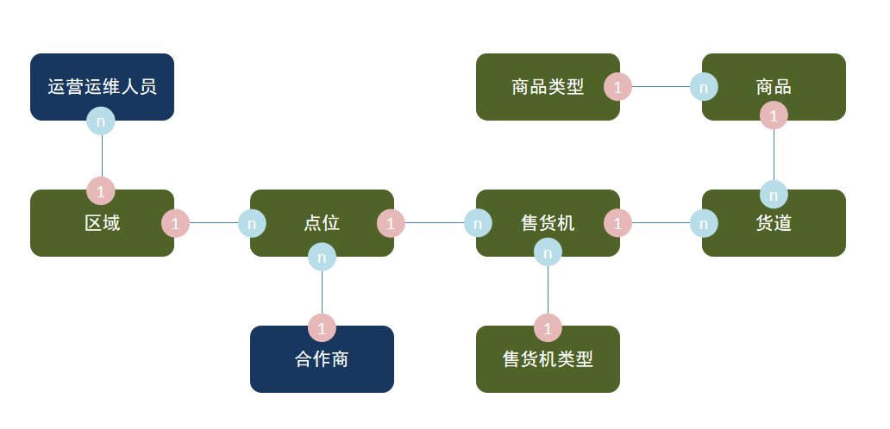

# 点位管理之数据库表结构、代码生成

## 一、需求说明

**业务场景**：公司现有一个宏伟的计划，在北京发展业务。

- 首先，需要确定几个有潜力的区域，这些区域可能是人流量大、消费能力高的商业区或居民区。
- 然后，我们要与这些区域内的潜在合作商，进行洽谈；
  - 比如：商场、写字楼、学校等地方的管理者或所有者。
- 一旦与合作商达成协议，确定了合作的细节和点位，就可以安排工作人员去投放智能售货机了。

点位管理主要涉及到三个功能模块，业务流程如下：

1. **登录系统**：后台管理人员登录后台系统；
2. **新增区域**：后台管理人员可以添加区域范围，区域范围与运维、运营人员挂钩，区域下可关联点位。
3. **新增合作商**: 管理人员可以添加合作商，合作商与点位进行关联。
4. **新增区域点位**: 后台管理人员可以在特定区域内新增点位，这些点位是放置智能售货机的具体位置。

```mermaid
graph TD
    A[登录系统]
    A --> B[新增区域]
    B --> C[新增合作商]
    C --> D[新增区域点位]
```

回顾点位、区域、合作商三张表之间的关系：



## 二、数据库表结构设计

### 2.1.区域表

查看[原型图](https://codesign.qq.com/app/s/426304924036117)中的”区域管理“，可知列表视图页面要展示以下字段：

序号、区域名称、点位数、备注说明、操作。

- ”序号“，并非数据库表中的主键，而是由前端生成的，所以区域表中不需要设置”序号“字段。
- ”点位数“，是”点位表“提供的信息，所以区域表中不需要设置”点位数“字段。

因此，区域表中的字段包含：主键 id、区域名称、备注说明。

### 2.2.合作商表

查看[原型图](https://codesign.qq.com/app/s/426304924036117)中的”合作商管理“，可知列表视图页面要展示以下字段：

序号、合作商名称、账号、点位数、分成比例、联系人、联系电话、操作。

- ”序号“，并非数据库表中的主键，而是由前端生成的，所以区域表中不需要设置”序号“字段。
- ”点位数“，是”点位表“提供的信息，所以合作商表中不需要设置”点位数“字段。

因此，合作商表中的字段包含：主键 id、合作商名称、联系人、联系电话、分成比例、账号、密码

### 2.3.点位管理表

查看[原型图](https://codesign.qq.com/app/s/426304924036117)中的”点位管理“，可知列表视图页面要展示以下字段：

序号、点位名称、所在区域、商圈类型、合作商、详细地址、操作。

- ”序号“，并非数据库表中的主键，而是由前端生成的，所以区域表中不需要设置”序号“字段。
- ”所在区域“，是”区域表“提供的信息，所以区域表中不需要设置”所在区域“字段。

因此，点位表中的字段包含：主键 id、点位名称、详细地址、商圈类型、区域外键、合作商外键、

- 其中”商圈类型“，为数据字典；1 旅游区、2 商场写字楼、3 学校、4 交通枢纽

### 2.4.若依的基础实体类 BaseEntity

`BaseEntity` 中，包含了基础的五个字段，数据库表中应该有这些字段。

dkd-common/src/main/java/com/dkd/common/core/domain/BaseEntity.java

```java
public class BaseEntity implements Serializable
{
    private static final long serialVersionUID = 1L;

    /** 搜索值 */
    @JsonIgnore
    private String searchValue;

    /** 创建者 */
    private String createBy;

    /** 创建时间 */
    @JsonFormat(pattern = "yyyy-MM-dd HH:mm:ss")
    private Date createTime;

    /** 更新者 */
    private String updateBy;

    /** 更新时间 */
    @JsonFormat(pattern = "yyyy-MM-dd HH:mm:ss")
    private Date updateTime;

    /** 备注 */
    private String remark;

    ……
}
```

使用 AIGC 生成数据库表结构：

Prompt 提示工程输入：

```markdown
你是一位软件工程师，帮我生成 MySQL 的表结构
需求如下：
1，区域表，表名 region，字段有：主键 id、区域名称
2，合作商表，表名 partner，字段有：主键 id、合作商名称、联系人、联系电话、分成比例（int 类型）、账号、密码
3，点位表，表名 node，字段有：主键 id、点位名称、详细地址、商圈类型（int 类型）
其他要求：
1，每张表中都有创建时间（create_time）、修改时间（date_time）、创建人（create_by）、修改人（update_by）、备注（remark）这些字段
2，每张表的主键都是自增的
3，区域与点位是一对多的关系，合作商与点位是一对多的关系，请用字段表示出来，并建立外键约束
4，请为所有字段都添加上 comment
5，帮我给生成的表中插入一些北京城市相关区域、点位、合作商的测试数据
```

AIGC 输出：

```mysql
USE `dkd`;

-- 区域表 region
CREATE TABLE region
(
    id          INT AUTO_INCREMENT PRIMARY KEY COMMENT '主键 ID',
    name        VARCHAR(100) NOT NULL COMMENT '区域名称',
    create_time DATETIME DEFAULT CURRENT_TIMESTAMP COMMENT '创建时间',
    update_time DATETIME DEFAULT CURRENT_TIMESTAMP ON UPDATE CURRENT_TIMESTAMP COMMENT '修改时间',
    create_by   VARCHAR(50) COMMENT '创建人',
    update_by   VARCHAR(50) COMMENT '修改人',
    remark      TEXT COMMENT '备注'
) ENGINE = InnoDB COMMENT ='区域表';

-- 合作商表 partner
CREATE TABLE partner
(
    id             INT AUTO_INCREMENT PRIMARY KEY COMMENT '主键 ID',
    name           VARCHAR(100) NOT NULL COMMENT '合作商名称',
    contact_person VARCHAR(50) COMMENT '联系人',
    contact_phone  VARCHAR(20) COMMENT '联系电话',
    profit_share   INT          NOT NULL COMMENT '分成比例',
    account        VARCHAR(50)  NOT NULL COMMENT '账号',
    password       VARCHAR(100) NOT NULL COMMENT '密码',
    create_time    DATETIME DEFAULT CURRENT_TIMESTAMP COMMENT '创建时间',
    update_time    DATETIME DEFAULT CURRENT_TIMESTAMP ON UPDATE CURRENT_TIMESTAMP COMMENT '修改时间',
    create_by      VARCHAR(50) COMMENT '创建人',
    update_by      VARCHAR(50) COMMENT '修改人',
    remark         TEXT COMMENT '备注'
) ENGINE = InnoDB COMMENT ='合作商表';

-- 点位表 node
CREATE TABLE node
(
    id                     INT AUTO_INCREMENT PRIMARY KEY COMMENT '主键 ID',
    name                   VARCHAR(100) NOT NULL COMMENT '点位名称',
    address                VARCHAR(255) COMMENT '详细地址',
    business_district_type INT COMMENT '商圈类型',
    region_id              INT          NOT NULL COMMENT '区域 ID',
    partner_id             INT          NOT NULL COMMENT '合作商 ID',
    create_time            DATETIME DEFAULT CURRENT_TIMESTAMP COMMENT '创建时间',
    update_time            DATETIME DEFAULT CURRENT_TIMESTAMP ON UPDATE CURRENT_TIMESTAMP COMMENT '修改时间',
    create_by              VARCHAR(50) COMMENT '创建人',
    update_by              VARCHAR(50) COMMENT '修改人',
    remark                 TEXT COMMENT '备注',
    FOREIGN KEY (region_id) REFERENCES region (id) ON DELETE CASCADE ON UPDATE CASCADE,
    FOREIGN KEY (partner_id) REFERENCES partner (id) ON DELETE CASCADE ON UPDATE CASCADE
) ENGINE = InnoDB COMMENT ='点位表';

-- 插入测试数据

-- 区域表测试数据
INSERT INTO region (name, create_by, remark)
VALUES ('北京市东城区', 'admin', '北京市核心区域'),
       ('北京市西城区', 'admin', '北京市重要行政区域');

-- 合作商表测试数据
INSERT INTO partner (name, contact_person, contact_phone, profit_share, account, password, create_by, remark)
VALUES ('北京百货公司', '张经理', '13800000001', 20, 'beijing_baihuo', '123456', 'admin', '主要合作商'),
       ('北京餐饮集团', '李经理', '13800000002', 15, 'beijing_canyin', '654321', 'admin', '餐饮相关合作商');

-- 点位表测试数据
INSERT INTO node (name, address, business_district_type, region_id, partner_id, create_by, remark)
VALUES ('东城区王府井商场', '北京市东城区王府井大街1号', 1, 1, 1, 'admin', '北京市著名商圈'),
       ('西城区金融街商场', '北京市西城区金融大街10号', 2, 2, 2, 'admin', '北京市高端商圈');
```

## 三、代码生成

用若依代码生成器，生成区域管理、合作商管理、点位管理前后端基础代码，并导入到项目中：

### 3.1.点位管理目录创建

创建菜单步骤：

- 左侧菜单 -> 系统管理 -> 菜单管理。
- 点击“新建”按钮，打开会话框。
- “上级菜单”，选择“主类目”。
- “菜单类型”，选择“目录”；
- “菜单图标”，选择一个图标。
- “菜单名称”，填写“点位管理”；
- “显示排序”，输入“2”；
- “**路由地址**”，填写“`node`”，用于前端路由页面跳转。
- 点击“确定”。

### 3.2.数据字典添加

创建”商圈类型“的字典类型。步骤如下：

1. 左侧菜单 -> 系统管理 -> 字典管理
2. 点击“新建”，打开新建数据字典对话框。
3. “字典名称”，填写“商圈类型”。
4. “字典类型”，填写“business_type”。
5. “备注”，填写“商圈类型”。
6. 点击”确定“。

为”商圈类型“数据字典，添加可选项：

1. 找到“商圈类型”行，点击“字典类型”列 business_type，进入字段数据页面。
2. 点击”新建“按钮，打开对话框。
3. ”数据标签“，填写”旅游区“。
4. ”数据键值“，填写”1“。
5. ”显示排序“，填写”1“。
6. 点击”确定“。
7. 依此类推，添加”商场写字楼“、”学校“、”交通枢纽“。

### 3.3.代码生成配置

1️⃣、打开系统的前端页面 -> 左侧菜单 -> 系统工具 -> 代码生成

2️⃣、点击“导入”，在导入表页面 -> 选择刚才 sql 脚本创建的 `node`、`partner`、`region` 数据库表 -> 确定

- 这步操作，将数据库表 `node`、`partner`、`region` 交给了若依框架的代码生成器进行管理。

3️⃣、在选项列表页面点击 `region` 这行记录的后方“操作”列的“编辑”按钮。

1. 点击“基本信息”选项卡，修改“实体表名称”、“作者”两项。
2. 点击“字段信息”选项卡，参考页面原型完成。
3. 点击“生成信息”选项卡，
   - “生成包路径”，改为 `com.dkd.manage`；
   - “生成模块名”，改为 `manage`；
   - ”生成功能名“，改为”区域管理“。这会是菜单的名称。
   - “上级菜单”，选择”点位管理“。表示前端左侧菜单的位置，如果不选，默认就在“系统工具”下。
4. 点击“提交”

4️⃣、依此类推，完成 `node`、`partner` 的配置。

> 文本域，是支持多行编辑的文本框。

5️⃣、在选项列表页面选中 `node`、`partner`、`region` 三行记录，点击“生成”按钮。会获得一个 zip 压缩包。

解压后，包含后端代码、前端代码、动态菜单 sql 文件三部分内容，如下所示；

├─📁 main/-------------- # Java 后端代码
├─📁 vue/--------------- # Vue 前端代码
├─📄 nodeMenu.sql------- # 动态菜单 sql 脚本
├─📄 partnerMenu.sql---- # 动态菜单 sql 脚本
└─📄 regionMenu.sql----- # 动态菜单 sql 脚本

### 3.4.代码导入

导入生成的生成的三个 sql 脚本，用于生成动态菜单。

isql/nodeMenu.sql
isql/partnerMenu.sql
isql/regionMenu.sql

在”菜单管理“中，调整它们的顺序。

再分别将前端代码、后端代码，导入到项目中。

> `.gitkeep` 文件，用于将空目录提交到 git 中。
