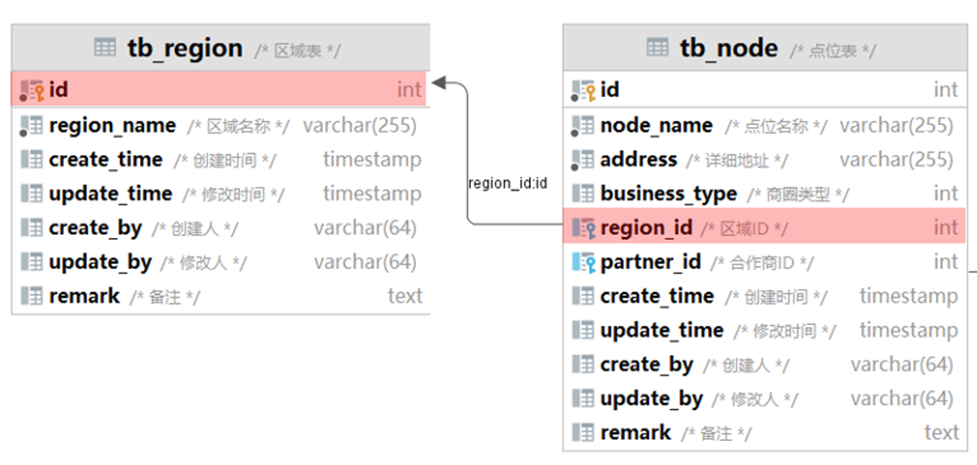

# 点位管理之区域管理改造

## 一、主键 id label 改造

在列表视图页面，将”主键 id“的 label 改为“序号”，并提供排序的功能。

 src/views/manage/region/index.vue

```vue
<el-table-column label="序号" type="index" width="50" align="center" prop="id" />
```

- `type="index"` 用于设置排序功能。
- `width="50"` 用于增加列的宽度。

## 二、操作列图标移除

src/views/manage/region/index.vue

```vue
<el-button link type="primary" icon="Edit" @click="handleUpdate(scope.row)" v-hasPermi="['manage:region:edit']">修改</el-button>
<el-button link type="primary" icon="Delete" @click="handleDelete(scope.row)" v-hasPermi="['manage:region:remove']">删除</el-button>

<!-- 改为 👇 -->

<el-button link type="primary" @click="handleUpdate(scope.row)" v-hasPermi="['manage:region:edit']">修改</el-button>
<el-button link type="primary" @click="handleDelete(scope.row)" v-hasPermi="['manage:region:remove']">删除</el-button>
```

- 去掉了 `icon="xxx"` 属性。

## 三、增加“点位数”列

在区域管理的列表视图中，增加“点位数”列。

接口信息如下：

**Path：** /manage/region/list

**Method：** GET

接口描述：

请求参数

Query

| 参数名称 | 是否必须 | 示例   | 备注     |
| -------- | -------- | ------ | -------- |
| pageNum  | 是       | 1      | 当前页   |
| pageSize | 是       | 10     | 每页个数 |
| name     | 否       | 海淀区 | 区域名称 |

返回数据

| 名称         | 类型      | 是否必须 | 默认值 | 备注     | 其他信息          |
| ------------ | --------- | -------- | ------ | -------- | ----------------- |
| total        | number    | 必须     |        |          | mock: 3           |
| rows         | object [] | 必须     |        |          | item 类型: object |
| ├─ remark    | string    | 必须     |        | 备注说明 |                   |
| ├─ id        | number    | 必须     |        | 区域ID   |                   |
| ├─ name      | string    | 必须     |        | 区域名称 |                   |
| ├─ nodeCount | number    | 必须     |        | 点位数量 |                   |
| code         | number    | 必须     |        |          | mock: 200         |
| msg          | string    | 必须     |        |          | mock: 查询成功    |

- 其中包含了 `nodeCount` 字段，表示“点位数”。

实现上方接口返回的方案有：

方案一：**（1）同步存储：**在区域表 `region` 中，存储点位数的字段，当点位发生变化时，同步区域表中的点位数。

- 优点：由于是单表查询操作，查询列表效率最高。
- 缺点：需要在点位增、删、改时，修改区域表中的字段值，有额外的开销，数据也可能不一致。

方案二：**（2）关联查询：**编写关联查询语句，在 mapper 层封装。

- 优点：实时查询，数据 100% 正确，不需要单独维护。
- 缺点：SQL 语句较复杂，如果数据量大，性能比较低。

区域和点位表，记录个数都不是很多，所以我们采用关联查询这种方案。



### 3.1.SQL 编写

传统方式：

```mysql
-- 1.先查询点位表，聚合统计每个区域下的点位
SELECT region_id, COUNT(*) node_count
FROM node
GROUP BY region_id;

-- 2.然后查询区域表，与上方的 sql 结果，进行左连接。
SELECT r.name, r.remark, n.node_count
FROM region r
         LEFT JOIN (SELECT region_id, COUNT(*) node_count FROM node GROUP BY region_id) n
                   ON r.id = n.region_id;

-- 3.使用 MySQL IFNULL 函数，去除查询到的 null 值。
SELECT r.name, r.remark, IFNULL(n.node_count, 0) AS node_count
FROM region r
         LEFT JOIN (SELECT region_id, COUNT(*) node_count FROM node GROUP BY region_id) n
                   ON r.id = n.region_id;
```

- `IFNULL` 函数`，用于处理 null 值。

使用 AI 生成：

Prompt 输入：

```markdown
查询区域表所有信息，需要显示每个区域的点位数
```

AIGC 输出：

```mysql
SELECT r.name AS region_name,
       r.remark,
       COUNT(n.id) AS node_count
FROM region r
     LEFT JOIN node n ON r.id = n.region_id
GROUP BY r.id;
```

### 3.2.VO 类设计

在 domain 包下，创建一个目录 vo，在其中创建 VO 类。

创建 `RegionVO` 类继承自 `Region` 类，在其中只需增加一个字段 `nodeCount`。

dkd-manage/src/main/java/com/dkd/manage/domain/vo/RegionVO.java

```java
@EqualsAndHashCode(callSuper = true)
@Data
@NoArgsConstructor
@AllArgsConstructor
public class RegionVO extends Region {
    // 点位数量
    private Integer nodeCount;
}
```

### 3.3.Region Mapper 层改造

在 `RegionMapper` 接口中，新增 `selectRegionVOList` 方法。

dkd-manage/src/main/java/com/dkd/manage/mapper/RegionMapper.java

```java
/**
 * 此方法用于：查询区域管理列表
 *
 * @param region 区域管理
 * @return List<RegionVO>
 */
List<RegionVO> selectRegionVOList(Region region);
```

在 XML 映射文件中，处理动态 SQL

dkd-manage/src/main/resources/mapper/manage/RegionMapper.xml

```xml
<select id="selectRegionVOList" resultType="com.dkd.manage.domain.vo.RegionVO">
    SELECT r.id, r.name, r.remark, COUNT(n.id) AS node_count
    FROM region r
    LEFT JOIN node n ON r.id = n.region_id
    <where>
        <if test="name != null and name != ''">AND r.name LIKE concat('%', #{name}, '%')</if>
    </where>
    GROUP BY r.id
</select>
```

注意事项：

- 因为使用了 PageHelper 分页查询，所有 DQL SQL 语句后面，都不能加 `;` 号。

- 从文件的其它动态 SQL 复制过来的 `<where>` 子标签，要放在 `GROUP BY` 语句的前面。其中要将表的别名加上；

- `node_count` 字段，要映射到类中的 `nodeCount` 字段，要打开 MyBatis 的驼峰命名转换配置（在若依中默认是关闭的）：

  dkd-admin/src/main/resources/mybatis/mybatis-config.xml

  ```xml
  <!-- 使用驼峰命名法转换字段 -->
  <setting name="mapUnderscoreToCamelCase" value="true"/>
  ```

### 3.4.Region Service 层改造

在 `IRegionService` 接口中，新增方法 `regionVoList`。

dkd-manage/src/main/java/com/dkd/manage/service/IRegionService.java

```java
/**
 * 此方法用于：查询区域管理列表
 *
 * @param region 区域管理
 * @return List<RegionVO>
 */
List<RegionVO> regionVoList(Region region);
```

在 `RegionServiceImpl` 实现类中，实现 `regionVoList` 方法。

dkd-manage/src/main/java/com/dkd/manage/service/impl/RegionServiceImpl.java

```java
/**
 * 此方法用于：查询区域管理列表
 *
 * @param region 区域管理
 * @return List<RegionVO>
 */
@Override
public List<RegionVO> regionVoList(Region region) {
    return regionMapper.selectRegionVOList(region);
}
```

### 3.5.Region Controller 层改造

`RegionController` 控制器类中的 `list` 方法改造。

dkd-manage/src/main/java/com/dkd/manage/controller/RegionController.java

```java
/**
 * 查询区域管理列表
 */
@PreAuthorize("@ss.hasPermi('manage:region:list')")
@GetMapping("/list")
public TableDataInfo list(Region region) {
    startPage();
    List<RegionVO> list = regionService.regionVoList(region);
    return getDataTable(list);
}
```

> 若依集成了热更新插件：
>
> - 如果没有新增文件，使用快捷键 Cmd + F9，就可以完成后端服务热更新。
> - 如果新增了文件，或者修改了 Maven 坐标，那么就要重启项目

### 3.6.前端组件修改

在前端页面加入一列，表示点位数。

src/views/manage/region/index.vue

```vue
<el-table-column label="点位数" align="center" prop="nodeCount" />
```

## 四、查看详情

在列表视图的每一行后面，加入“查看详情”的按钮。

src/views/manage/region/index.vue

```vue
<el-table-column label="操作" align="center" class-name="small-padding fixed-width">
  <template #default="scope">
    <el-button
      link
      type="primary"
      @click="handleDetailInfo(scope.row)"
      v-hasPermi="['manage:node:list']"
      >查看详情</el-button
    >
    </el-button>
  </template>
</el-table-column>
```

新增“区域详情”的对话框，点击“查看详情”按钮，展示该对话框。

src/views/manage/region/index.vue

```vue
<!-- 查看详情对话框 -->
<el-dialog v-model="openView" title="区域详情" width="500px" append-to-body>
  <el-form-item label="区域名称" prop="name">
    <el-input v-model="form.name" placeholder="请输入区域名称" disabled />
  </el-form-item>
  <label>包含点位：</label>
  <el-table :data="nodeList">
    <el-table-column label="序号" type="index" align="center" width="50" />
    <el-table-column label="点位名称" align="center" prop="name" />
    <el-table-column label="设备数量" align="center" prop="vmCount" />
  </el-table>
</el-dialog>
```

添加事件处理函数：

src/views/manage/region/index.vue

```javascript
import { listNode } from '@/api/manage/node'
import { loadAllParams } from '@/api/page'

……

const nodeList = ref([]) // 点位列表
const openView = ref(false) // 区域详情弹窗开关
/** 查看区域详情 */
function handleDetailInfo(row) {
  // 查看区域信息
  reset()
  const _id = row.id
  getRegion(_id).then(response => {
    form.value = response.data
  })
  // 查看点位列表
  const params = { ...loadAllParams, regionId: _id }
  listNode(params)
    .then(res => {
      nodeList.value = res.rows
    })
    .catch(() => {})
  openView.value = true
}
```
