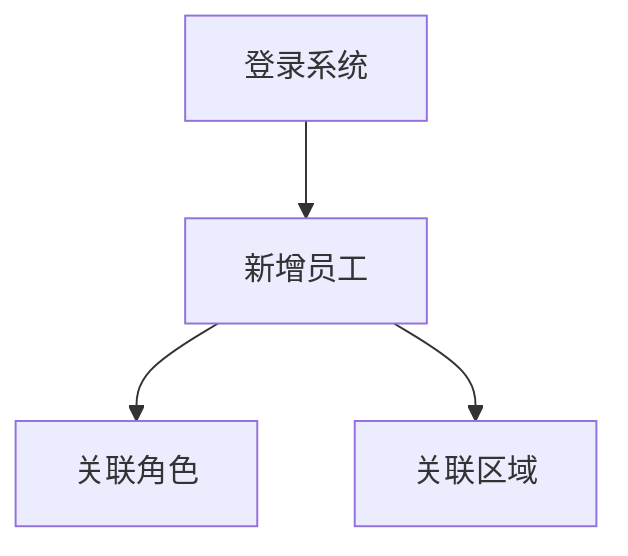

# 人员管理-代码生成

人员管理业务流程如下：

1. **登录系统：** 首先，后台管理人员需要登录到帝可得后台管理系统中。
2. **新增工作人员：** 登录系统后，管理人员可以新增工作人员，包括姓名、联系方式等信息。
3. **关联角色：** 确定此员工是运维人员还是运营人员，这将影响他们的职责和权限。
4. **关联区域：** 确定员工负责的区域范围，确保工作人员能够高效地完成区域内的设备安装、维修、商品补货等工作。

对于人员和其他管理数据，下面是示意图：

- 关系字段：role_id、region_id
- 数据字典：status（1 启用、0 停用）
- 冗余字段：region_name、role_code、role_name

使用若依代码生成器，生成人员列表前后端基础代码，并导入到项目中：

## 一、目录菜单创建

创建人员管理目录菜单：

- 左侧菜单 -> 系统管理 -> 菜单管理。
- 点击“新建”按钮，打开会话框。
- “上级菜单”，选择“主类目”。
- “菜单类型”，选择“目录”；
- “菜单图标”，选择 peoples 图标。
- “菜单名称”，填写“人员管理”；
- “显示排序”，输入“4”；
- “**路由地址**”，填写“`emp`”，用于前端路由页面跳转。
- 点击“确定”。

## 二、数据字典添加

创建”商圈类型“的字典类型。步骤如下：

1. 左侧菜单 -> 系统管理 -> 字典管理
2. 点击“新建”，打开新建数据字典对话框。
3. “字典名称”，填写“员工状态”。
4. “字典类型”，填写“emp_status”。
5. “备注”，填写“员工状态”。
6. 点击”确定“。

为”商圈类型“数据字典，添加可选项：

1. 找到“员工状态”行，点击“字典类型”列 emp_status，进入字段数据页面。
2. 点击”新建“按钮，打开对话框。
3. ”数据标签“，填写”启用“。
4. ”数据键值“，填写”1“。
5. ”显示排序“，填写”1“。
6. 点击”确定“。
7. 依此类推，添加”停用“状态。

## 三、代码生成

1️⃣、打开系统的前端页面 -> 左侧菜单 -> 系统工具 -> 代码生成

2️⃣、点击“导入”，在导入表页面 -> 选择使用 sql 脚本创建过的 `emp`、`role` 数据库表 -> 确定

- 这步操作，将数据库 `emp`、`role` 交给了若依框架的代码生成器进行管理。

3️⃣、在选项列表页面点击 `emp` 这行记录的后方“操作”列的“编辑”按钮。

1. 点击“基本信息”选项卡，修改“实体表名称”、“作者”两项。
2. 点击“字段信息”选项卡，参考页面原型完成。
3. 点击“生成信息”选项卡，
   - “生成包路径”，改为 `com.dkd.manage`；
   - “生成模块名”，改为 `manage`；
   - ”生成功能名“，改为”人员列表“。这会是菜单的名称。
   - “生成业务名”，改为“emp”。
   - “上级菜单”，选择”人员管理“。表示前端左侧菜单的位置，如果不选，默认就在“系统工具”下。
4. 点击“提交”

4️⃣、依此类推，完成 `role` 的配置。

- role 表不需要对应的前端页面，所以“字段信息”可以保持默认。

5️⃣、在选项列表页面选中 `emp`、`role` 二行记录，点击“生成”按钮。会获得一个 zip 压缩包。

解压后，包含后端代码、前端代码、动态菜单 sql 文件三部分内容，如下所示；

├─📁 main/----------- # 后端代码
├─📁 vue/------------ # 前端代码
├─📄 empMenu.sql----- # 菜单动态 sql
└─📄 roleMenu.sql---- # 菜单动态 sql

## 四、代码导入

### 4.1.动态菜单导入

只需要导入员工的动态菜单即可，不需要导入角色的。

empMenu.sql

刷新前端页面，发现在人员管理菜单下，多了一个人员列表菜单。

### 4.2.前端代码导入

再将前端代码、导入到项目中。

- 前端视图组件，也只需要导入员工的即可，不需要导入角色的

### 4.3.后端代码导入

再将后端代码，导入到项目中。
