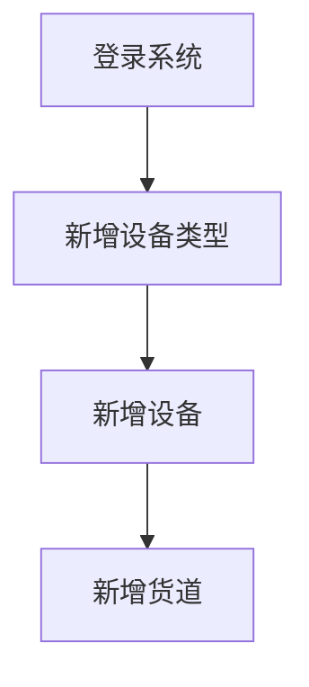

# 设备管理-代码生成

点位管理，主要涉及到三个功能模块，业务流程如下：

1. **新增设备类型**: 允许管理员定义新的售货机型号，包括其规格和容量。
2. **新增设备**: 在新的设备类型定义后，系统应允许添加新的售货机实例，并将它们分配到特定的点位。
3. **新增货道**: 对于每个新添加的设备，系统应支持定义新的货道，后期用于关联相应的商品 SKU。

对于设备和其他管理数据，下面是示意图：

- 关系字段：vm_type_id、node_id、vm_id
- 数据字典：vm_status（0 未投放、1 运营、3 撤机）
- 冗余字段：addr、business_type、region_id、partner_id（简化查询接口、提高查询效率）

货道没有单独的页面原型，它是紧密集成到设备管理中的一个组件。

## 一、目录菜单创建

创建人员管理目录菜单：

- 左侧菜单 -> 系统管理 -> 菜单管理。
- 点击“新建”按钮，打开会话框。
- “上级菜单”，选择“主类目”。
- “菜单类型”，选择“目录”；
- “菜单图标”，选择 peoples 图标。
- “菜单名称”，填写“设备管理”；
- “显示排序”，输入“3”；
- “**路由地址**”，填写“`vm`”，用于前端路由页面跳转。
- 点击“确定”。

## 二、数据字典添加

创建”商圈类型“的字典类型。步骤如下：

1. 左侧菜单 -> 系统管理 -> 字典管理
2. 点击“新建”，打开新建数据字典对话框。
3. “字典名称”，填写“设备状态”。
4. “字典类型”，填写“vm_status”。
5. “备注”，填写“设备状态”。
6. 点击”确定“。

为”商圈类型“数据字典，添加可选项：

1. 找到“员工状态”行，点击“字典类型”列 vm_status，进入字段数据页面。
2. 点击”新建“按钮，打开对话框。
3. ”数据标签“，填写”未投放“。
4. ”数据键值“，填写”0“。
5. ”显示排序“，填写”1“。
6. 点击”确定“。
7. 依此类推，添加”运营“、“撤机”状态。

## 三、代码生成

1️⃣、打开系统的前端页面 -> 左侧菜单 -> 系统工具 -> 代码生成

2️⃣、点击“导入”，在导入表页面 -> 选择使用 sql 脚本创建过的 `vm_type`、`vending_machine`、`channel` 数据库表 -> 确定

- 这步操作，将数据库 `vm_type`、`vending_machine`、`channel` 交给了若依框架的代码生成器进行管理。

3️⃣、在选项列表页面点击 `emp` 这行记录的后方“操作”列的“编辑”按钮。

1. 点击“基本信息”选项卡，修改“实体表名称”、“作者”两项。
2. 点击“字段信息”选项卡，参考页面原型完成。
3. 点击“生成信息”选项卡，
   - “生成包路径”，改为 `com.dkd.manage`；
   - “生成模块名”，改为 `manage`；
   - ”生成功能名“，改为”设备类型管理“。这会是菜单的名称。
   - “生成业务名”，改为“vmType“。
   - “上级菜单”，选择”设备管理“。表示前端左侧菜单的位置，如果不选，默认就在“系统工具”下。
4. 点击“提交”

4️⃣、依此类推，完成 `vending_machine`、`channel` 的配置。

- `channel`（货道表）不需要对应的前端页面，所以“字段信息”可以保持默认。

5️⃣、在选项列表页面，选中  `vm_type`、`vending_machine`、`channel`  二行记录，点击“生成”按钮。会获得一个 zip 压缩包。

解压后，包含后端代码、前端代码、动态菜单 sql 文件三部分内容，如下所示；

├─📁 main/-------------- # 后端代码
├─📁 vue/--------------- # 前端代码
├─📄 channelMenu.sql---- # 菜单动态 sql
├─📄 vmMenu.sql--------- # 菜单动态 sql
└─📄 vmTypeMenu.sql----- # 菜单动态 sql

## 四、代码导入

### 4.1.动态菜单导入

只需要导入设备状态（`vm_type`）、设备（`vending_machine`）动态菜单即可，不需要导入货道（`channel`）的。

isql/vmMenu.sql

isql/vmTypeMenu.sql

刷新前端页面，发现在设备管理菜单下，多了设备管理，设备类型管理菜单。

> 菜单动态 sql 导入后，生成的菜单，默认排序都是 1；

### 4.2.前端代码导入

再将前端代码、导入到项目中。

- 前端视图组件，也只需要导入设备状态（`vm_type`）、设备（`vending_machine`）即可，不需要导入货道（`channel`）的。

### 4.3.后端代码导入

再将后端代码，导入到项目中。