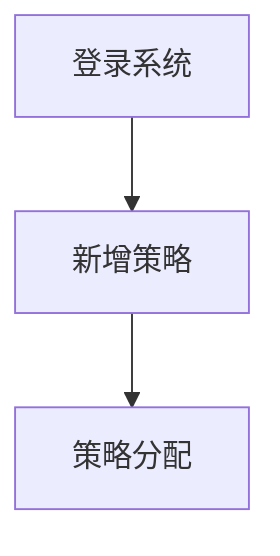

# 策略管理之代码生成

需求说明：

- 管理用可以在系统里，为每一台设备，设置一个折扣，用于营销。

策略管理主要涉及到二个功能模块，业务流程如下：

1. **新增策略**: 允许管理员定义新的策略，包括策略的具体内容和参数（如折扣率）
2. **策略分配**: 将策略分配给一个或多个售货机。



对于策略和其他管理数据，下面是示意图：

- 关系字段：policy_id


## 一、目录菜单创建

创建人员管理目录菜单：

- 左侧菜单 -> 系统管理 -> 菜单管理。
- 点击“新建”按钮，打开会话框。
- “上级菜单”，选择“主类目”。
  - “菜单类型”，选择“目录”；
- “菜单图标”，选择策略图标。
- “菜单名称”，填写“`策略管理`”；
- “显示排序”，输入“`7`”；
- “**路由地址**”，填写“`policy`”，用于前端路由页面跳转。
- 点击“确定”。

## 二、代码生成

1️⃣、打开系统的前端页面 -> 左侧菜单 -> 系统工具 -> 代码生成

2️⃣、点击“导入”，在导入表页面 -> 选择使用 sql 脚本创建过的 `policy` 数据库表 -> 确定

- 这步操作，将数据库 `policy` 交给了若依框架的代码生成器进行管理。

3️⃣、在选项列表页面点击 `policy` 这行记录的后方“操作”列的“编辑”按钮。

1. 点击“基本信息”选项卡，修改“实体表名称”、“作者”两项。
2. 点击“字段信息”选项卡，参考页面原型完成。
3. 点击“生成信息”选项卡，
   - “生成包路径”，改为 `com.dkd.manage`；
   - “生成模块名”，改为 `manage`；
   - ”生成功能名“，改为”策略管理“。这会是菜单的名称。
   - “生成业务名”，改为“`policy`“。
   - “上级菜单”，选择”策略管理“。表示前端左侧菜单的位置，如果不选，默认就在“系统工具”下。
4. 点击“提交”

4️⃣、在选项列表页面，选中 `policy`  这行记录，点击“生成”按钮。会获得一个 zip 压缩包。

解压后，包含后端代码、前端代码、动态菜单 sql 文件三部分内容，如下所示；

├─📁 main/-------------- # 后端代码
├─📁 vue/--------------- # 前端代码
├─📄 policyMenu.sql---- # 菜单动态 sql

## 三、代码导入

执行菜单动态 sql 脚本。

将前端代码导入。

将后端代码导入。

## 四、添加、修改对话框改造

### 4.1.策略方案设为数字文本框

将“策略方案”是一个折扣数字。所以要将它改为数字文本框，只能输入**大于 1，小于 100 的数字。不能是小数**。

src/views/manage/policy/index.vue

```vue
<el-form-item label="策略方案" prop="discount">
  <el-input-number :min="1" :max="100" :precision="0" v-model="form.discount" placeholder="请输入策略方案" />
</el-form-item>
```

## 五、列表视图改造

### 5.1.查看详情功能

在列表视图的“操作”列，加入“查看详情”的按钮。

点击该按钮，查询应用该策略的设备信息。并在“查看策略详情”对话框中展示。

src/views/manage/policy/index.vue

```vue
<template>
  <el-table-column label="操作" align="center" class-name="small-padding fixed-width">
    <template #default="scope">
      <el-button
        link
        type="primary"
        @click="handlePolicyInfo(scope.row)"
        v-hasPermi="['manage:vm:list']"
        >查看详情</el-button
      >
      <el-button
        link
        type="primary"
        @click="handleUpdate(scope.row)"
        v-hasPermi="['manage:policy:edit']"
        >修改</el-button
      >
      <el-button
        link
        type="primary"
        @click="handleDelete(scope.row)"
        v-hasPermi="['manage:policy:remove']"
        >删除</el-button
      >
    </template>
  </el-table-column>

  ……

  <!-- 查看策略详情对话框 -->
  <el-dialog title="策略详情" v-model="policyinfoOpen" width="500px" append-to-body>
    <el-form :model="form" label-width="80px">
      <el-form-item label="策略名称" prop="policyName">
        <el-input v-model="form.policyName" disabled placeholder="请输入策略名称" />
      </el-form-item>
    </el-form>
    <label>点位详情：</label>
    <el-table :data="vmList">
      <el-table-column label="序号" type="index" align="center" width="50" />
      <el-table-column label="点位地址" align="center" prop="addr" show-overflow-tooltip />
      <el-table-column label="设备编号" align="center" prop="innerCode" />
    </el-table>
  </el-dialog>
</template>

<script>
import { listVm } from '@/api/manage/vm'
import { loadAllParams } from '@/api/page'

……

/** 查询策略详情 */
const vmList = ref([])
const policyinfoOpen = ref(false)
const handlePolicyInfo = row => {
  // 获取策略信息
  form.value = row // 将 row 赋值给 form，以便展示策略名称
  loadAllParams.policyId = row.policyId

  // 根据策略 id，查询设备列表
  listVm(loadAllParams).then(res => {
    vmList.value = res.rows
    policyinfoOpen.value = true
  })
}
</script>
```

- “查看详情”按钮的权限是 `manage:vm:list`
- `handlePolicyInfo` 方法中的 `form.value = row`，用于在对话框中展示策略名称。

## 六、设备策略改造

在设备管理页面中，点击“操作”列的“策略”按钮，对设备设置一个固定折扣，用于营销。

在设备管理的列表视图的“操作”列，新增“策略”按钮。

src/views/manage/vm/index.vue

```vue
<!-- 策略分配对话框 -->
<el-table v-loading="loading" :data="vmList" @selection-change="handleSelectionChange">
  ……
  <el-table-column label="操作" align="center" class-name="small-padding fixed-width">
    <template #default="scope">
      <el-button
        link
        type="primary"
        @click="handlePolicy(scope.row)"
        v-hasPermi="['manage:vm:edit']"
        >策略</el-button
      >
      <el-button
        link
        type="primary"
        @click="handleUpdate(scope.row)"
        v-hasPermi="['manage:vm:edit']"
        >修改</el-button
      >
    </template>
  </el-table-column>
</el-table>
```

在设备管理页面，引入查询策略列表的函数 `listPolicy`

src/views/manage/vm/index.vue

```vue
<script>
<script setup name="Vm">
……
import { listPolicy } from '@/api/manage/policy';
import { loadAllParams } from '@/api/page'
……
/** 设备策略分配 */
const policyOpen = ref(false)
const policyList = ref([])
const handlePolicy = row => {
  // 为表单赋值策略 id 和设备 id
  form.value.id = row.id
  form.value.policyId = row.policyId
  // 查询策略列表
  listPolicy(loadAllParams).then(res => {
    policyList.value = res.rows
    policyOpen.value = true
  })
}
</script>
```

在设备管理页面，新增策略分配对话框

为该对话框，加上“确定”和“取消”按钮。

src/views/manage/vm/index.vue

```vue
<!-- 策略分配对话框 -->
<el-dialog title="策略分配" v-model="policyOpen" width="500px" append-to-body>
  <el-form ref="vmRef" :model="form" label-width="110px">
    <el-form-item label="选择策略" prop="policyId">
      <el-select v-model="form.policyId" placeholder="请选择策略">
        <el-option
          v-for="item of policyList"
          :key="item.policyId"
          :label="item.policyName"
          :value="item.policyId"
        />
      </el-select>
    </el-form-item>
  </el-form>
  <template #footer>
    <div class="dialog-footer">
      <el-button type="primary" @click="submitForm">确 定</el-button>
      <el-button @click="cancel">取 消</el-button>
    </div>
  </template>
</el-dialog>

<script>
……
  // 取消按钮
function cancel() {
  open.value = false
  policyOpen.value = false // 用于关闭策略分配对话框
  reset()
}
……
/** 提交按钮 */
function submitForm() {
  proxy.$refs['vmRef'].validate(valid => {
    if (valid) {
      if (form.value.id != null) {
        updateVm(form.value).then(response => {
          proxy.$modal.msgSuccess('修改成功')
          open.value = false
          policyOpen.value = false // 用于关闭策略分配对话框
          getList()
        })
      } else {
        addVm(form.value).then(response => {
          proxy.$modal.msgSuccess('新增成功')
          open.value = false
          policyOpen.value = false // 用于关闭策略分配对话框
          getList()
        })
      }
    }
  })
}
</script>
```

在修改设备记录中的策略 id 时，回引起空指针异常，原因是没有传入点位 id。

后端代码改造如下，加入 if 条件判断；

dkd-manage/src/main/java/com/dkd/manage/service/impl/VendingMachineServiceImpl.java

```java
/**
 * 修改设备管理
 *
 * @param vendingMachine 设备管理
 * @return 结果
 */
@Override
public int updateVendingMachine(VendingMachine vendingMachine) {
    // 查询点位表
    Long nodeId = vendingMachine.getNodeId();
    if (nodeId != null) {
        Node node = iNodeService.selectNodeById(nodeId);
        BeanUtils.copyProperties(node, vendingMachine, "id"); // 合作商 id、区域 id
        vendingMachine.setBusinessType(node.getBusinessDistrictType()); // 商圈类型
        vendingMachine.setAddr(node.getAddress()); // 设备地址
        vendingMachine.setUpdateTime(DateUtils.getNowDate()); // 更新时间
    }

    return vendingMachineMapper.updateVendingMachine(vendingMachine);
}
```
