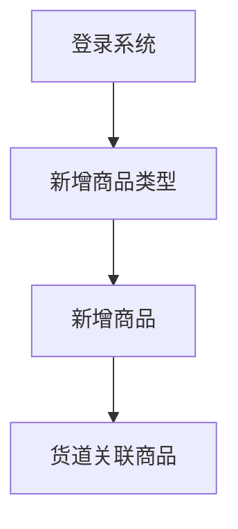

# 商品管理之代码生成

商品管理，主要涉及到三个功能模块，业务流程如下：

1. **新增商品类型**：定义商品的不同分类，如饮料、零食、日用品等。
2. **新增商品**：添加新的商品信息，包括名称、规格、价格、类型等。
3. **设备货道管理**: 将商品与售货机的货道关联，管理每个货道的商品信息。

商品管理相关表，和 其它表的关系如下

- 关系字段：class_id、sku_id、vm_id

## 一、目录菜单创建

创建人员管理目录菜单：

- 左侧菜单 -> 系统管理 -> 菜单管理。
- 点击“新建”按钮，打开会话框。
- “上级菜单”，选择“主类目”。
- “菜单类型”，选择“目录”；
- “菜单图标”，选择商品管理图标。
- “菜单名称”，填写“商品管理”；
- “显示排序”，输入“5”；
-  “**路由地址**”，填写“`sku`”，用于前端路由页面跳转。
- 点击“确定”。

## 二、代码生成

1️⃣、打开系统的前端页面 -> 左侧菜单 -> 系统工具 -> 代码生成

2️⃣、点击“导入”，在导入表页面 -> 选择使用 sql 脚本创建过的 `sku`、`sku_class` 数据库表 -> 确定

- 这步操作，将数据库 `sku`、`sku_class` 交给了若依框架的代码生成器进行管理。

3️⃣、在选项列表页面点击 `sku` 这行记录的后方“操作”列的“编辑”按钮。

1. 点击“基本信息”选项卡，修改“实体表名称”、“作者”两项。
2. 点击“字段信息”选项卡，参考页面原型完成。
3. 点击“生成信息”选项卡，
   - “生成包路径”，改为 `com.dkd.manage`；
   - “生成模块名”，改为 `manage`；
   - ”生成功能名“，改为”商品管理“。这会是菜单的名称。
   - “生成业务名”，改为“`sku`”。
   - “上级菜单”，选择”商品管理“。表示前端左侧菜单的位置，如果不选，默认就在“系统工具”下。
4. 点击“提交”

4️⃣、依此类推，完成 `sku_class` 的配置。

5️⃣、在选项列表页面选中 `sku`、`sku_class`  二行记录，点击“生成”按钮。会获得一个 zip 压缩包。

解压后，包含后端代码、前端代码、动态菜单 sql 文件三部分内容，如下所示；

├─📁 main/----------- # 后端代码
├─📁 vue/------------ # 前端代码
├─📄 skuClassMenu.sql----- # 菜单动态 sql
└─📄 skuMenu.sql---- # 菜单动态 sql

## 三、代码导入

执行菜单动态 sql 脚本。

将前端代码导入。

将后端代码导入。