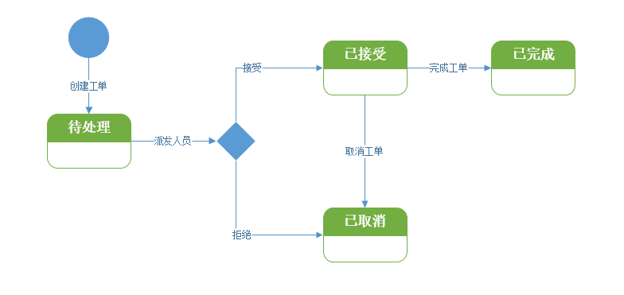
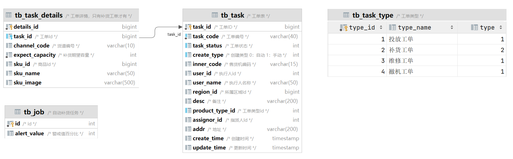

# 工单管理之代码生成

需求说明：工单是一种专业名词，是指用于“记录、处理、跟踪”一项工作的完成情况。

- 管理员登录后台管理系统，选择创建工单，在工单类型里，选择合适的工单类型，在设备编号里，输入正确的设备编号。
- 工作人员在运营管理 App，可以看到分配给自己的工单，根据实际情况，选择接收工单并完成，或者拒绝/取消工单。

帝可得工单，分为两大类 ：

- 运营工单：运营人员来维护售货机**商品**，即补货工单。

- 运维工单：运维人员来维护售货机**设备**，即投放工单、撤机工单、维修工单。

工单有四种状态：它们之间的流转，如下图所示：

- 待处理；进行中；已取消；已完成



工单表，与其它相关表结构的关系，如下图所示：

- 关系字段：task_id、 product_type_id、inner_code、user_id、assignor_id、region_id
- 数据字典：工单状态 task_status（1 待办、2 进行、3 取消、4 完成）
- 数据字典：工单创建类型 create_type（0 自动、1 手动）
- PS：运营的工单包含补货信息，运维工单没有，所以运营工单需要单独创建补货工单



## 一、目录菜单创建

创建商品管理目录菜单：

- 左侧菜单 -> 系统管理 -> 菜单管理。
- 点击“新建”按钮，打开会话框。
- “上级菜单”，选择“主类目”。
- “菜单类型”，选择“目录”；
- “菜单图标”，选择商品管理图标。
- “菜单名称”，填写“工单管理”；
- “显示排序”，输入“1”；
- “**路由地址**”，填写“`task`”，用于前端路由页面跳转。
- 点击“确定”。

## 二、数据字典添加

### 2.1.工单状态-数据字典

创建”工单状态“的字典类型。步骤如下：

1. 左侧菜单 -> 系统管理 -> 字典管理
2. 点击“新建”，打开新建数据字典对话框。
3. “字典名称”，填写“工单状态”。
4. “字典类型”，填写“`task_status`”。
5. “备注”，填写“工单状态”。
6. 点击”确定“。

为”工单状态“数据字典，添加可选项：

1. 找到“员工状态”行，点击“字典类型”列 `task_status`，进入字段数据页面。
2. 点击”新建“按钮，打开对话框。
3. ”数据标签“，填写”代办“。
4. ”数据键值“，填写”1“。
5. ”显示排序“，填写”1“。
6. 点击”确定“。
7. 依此类推，添加”进行“、“取消”、“完成”状态。

### 2.2.工单创建类型-数据字典

创建”工单创建类型“的字典类型。步骤如下：

1. 左侧菜单 -> 系统管理 -> 字典管理
2. 点击“新建”，打开新建数据字典对话框。
3. “字典名称”，填写“工单创建类型”。
4. “字典类型”，填写“`task_create_type`”。
5. “备注”，填写“工单创建类型”。
6. 点击”确定“。

为”工单创建类型“数据字典，添加可选项：

1. 找到“工单创建类型”行，点击“字典类型”列 `task_create_type`，进入字段数据页面。
2. 点击”新建“按钮，打开对话框。
3. ”数据标签“，填写”自动“。
4. ”数据键值“，填写”0“。
5. ”显示排序“，填写”1“。
6. 点击”确定“。
7. 依此类推，添加”手动“状态。

## 三、代码生成

工单管理模块的前端代码，已经在资料中准备好，导入即可。所以在配置字段信息时，尽量让条件更加丰富，这样后期扩展性更强。

- 注意：给“工单状态”，“创建类型”两个字段，设置数据字典。

1️⃣、打开系统的前端页面 -> 左侧菜单 -> 系统工具 -> 代码生成

2️⃣、点击“导入”，在导入表页面 -> 选择使用 sql 脚本创建过的 `task`、`task_details`、`task_type`、`job` 数据库表 -> 确定

- 这步操作，将数据库 `task`、`task_details`、`task_type`、`job` 交给了若依框架的代码生成器进行管理。

3️⃣、在选项列表页面点击 `task` 这行记录的后方“操作”列的“编辑”按钮。

1. 点击“基本信息”选项卡，修改“实体表名称”、“作者”两项。
2. 点击“字段信息”选项卡，参考页面原型完成。
3. 点击“生成信息”选项卡，
   - “生成包路径”，改为 `com.dkd.manage`；
   - “生成模块名”，改为 `manage`；
   - ”生成功能名“，改为”工单“。这会是菜单的名称。
   - “生成业务名”，改为“`task`“。
   - “上级菜单”，选择”工单管理“。表示前端左侧菜单的位置，如果不选，默认就在“系统工具”下。
4. 点击“提交”

4️⃣、依此类推，完成 `task_details`、`task_type`、`job` 的配置。

5️⃣、在选项列表页面，选中 `task`、`task_details`、`task_type`、`job` 四行记录，点击“生成”按钮。会获得一个 zip 压缩包。

解压后，包含后端代码、前端代码、动态菜单 sql 文件三部分内容，如下所示；

```txt
├─📁 main/------------------ # 后端代码
├─📁 vue/------------------- # 前端代码
├─📄 jobMenu.sql
├─📄 taskDetailsMenu.sql
├─📄 taskMenu.sql
└─📄 taskTypeMenu.sql
```

## 四、自动生成代码导入

生成的文件中，仅需导入后端代码部份即可。

### 4.1.后端代码导入

将后端代码，导入到项目中。

重启后端工程。

## 五、资料准备代码导入

### 5.1.前端代码导入

将准备好的“07-工单前端”代码，导入到前端工程中。

```txt
├─📁 api/
│ ├─📁 manage/
│ │ ├─📄 task.js
│ │ └─📄 taskType.js
│ 
├─📁 views/
│ ├─📁 task/
│ │ ├─📁 components/
│ │ ├─📄 .DS_Store
│ │ ├─📄 business.vue
│ │ ├─📄 index.scss
│ │ └─📄 operation.vue
```

### 5.2.菜单配置

“运营工单”菜单配置步骤：

- 左侧菜单 -> 系统管理 -> 菜单管理。
- 点击“新建”按钮，打开会话框。
- “上级菜单”，选择“工单管理”。
- “菜单类型”，选择“菜单”；
- “菜单图标”，不选择。
- “菜单名称”，填写“运营工单”；
- “显示排序”，输入“1”；
- “**路由地址**”，填写“`business`”，用于前端路由页面跳转。
- “**组件路径**”，填写“`manage/task/business`”；
- “**权限字符串**”，填写“`manage:task:list`”
- 点击“确定”。

“运维工单”菜单配置步骤：

- 左侧菜单 -> 系统管理 -> 菜单管理。
- 点击“新建”按钮，打开会话框。
- “上级菜单”，选择“工单管理”。
- “菜单类型”，选择“菜单”；
- “菜单图标”，不选择。
- “菜单名称”，填写“运维工单”；
- “显示排序”，输入“2”；
- “**路由地址**”，填写“`operation`”，用于前端路由页面跳转。
- “**组件路径**”，填写“`manage/task/operation`”；
- “**权限字符串**”，填写“`manage:task:list`”
- 点击“确定”。

刷新页面，报了一个 SQL 语法异常；原因是 `TaskMapper` 文件中，有一个 desc 字段，与 MySQL 中的关键字重合了。

将 `desc` 加上反引号。

dkd-manage/src/main/resources/mapper/manage/TaskMapper.xml

```xml
<sql id="selectTaskVo">
    select task_id, task_code, task_status, create_type, inner_code, user_id, user_name, region_id, `desc`, product_type_id, assignor_id, addr, create_time, update_time from task
</sql>
```

至此，页面已经导入完成，刷新页面，可以看到“运营工单”、“运维工单”两个菜单显示在左侧。

点击进入后，会发现，两个菜单展示的内容是完全一样的。
