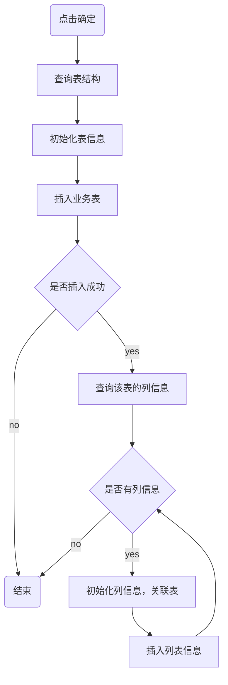
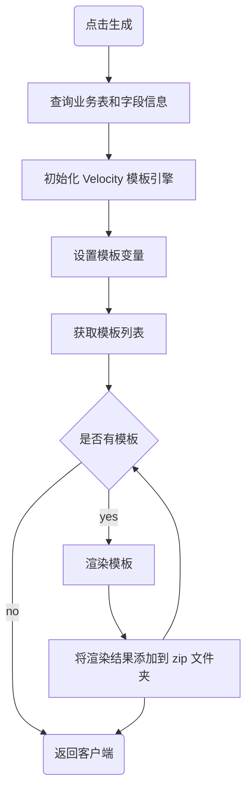
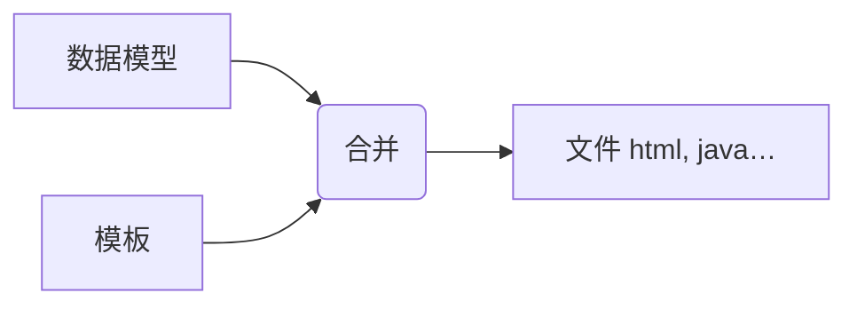

# 原理篇之代码生成器

代码生成器，是提高开发效率的重要工具，它主要分为两个部分：

第一部分：将业务表结构，导入到系统中，在这里，开发者可以预览、编辑、删除和同步业务表结构，实现对业务表的全面管理。

第二部分：是在选择了特定的表之后，点击生成按钮，系统将根据表结构，生成相应的前后端代码，并提供下载。


## 一、数据库表结构说明

若依提供了两张核心表，来存储导入的业务表信息：

- `gen_table` 表：存储业务表的基本信息，它对应于配置代码“基本信息”和“生成信息”的页面；
- `gen_table_column` 表：存储业务表的字段信息     它对应于配置代码“字段信息”的页面。

这两张表是一对多的关系，一张业务表可以有多个字段的信息，所以在字段信息表中有个外键 `table_id` 指向业务表中的 `table_id` 字段


## 二、项目结构说明

### 2.1.后端项目说明

dkd-generator

```directory
├─📁 src
│ └─📁 main
│   ├─📁 java
│   │ └─📁 com
│   │   └─📁 dkd
│   │     └─📁 generator
│   │       ├─📁 config-------- # 读取代码生成相关配置
│   │       ├─📁 controller
│   │       ├─📁 domain
│   │       ├─📁 mapper
│   │       ├─📁 service
│   │       └─📁 util---------- # Velocity 模板工具类
│   └─📁 resources
│     ├─📁 mapper
│     │ └─📁 generator
│     ├─📁 vm
│     └─📄 generator.yml
```

### 2.2.前端项目结构

```directory
├─📁 bin
├─📁 html
├─📁 public
├─📁 src
│ ├─📁 api
│ │ ├─📁 manage
│ │ ├─📁 monitor
│ │ ├─📁 system
│ │ ├─📁 tool
│ │ │ └─📄 gen.js----------------- # Api 请求 Js 文件
│ │ ├─📄 login.js
│ │ ├─📄 menu.js
│ │ └─📄 page.js
│ ├─📁 assets
│ ├─📁 components
│ ├─📁 directive
│ ├─📁 layout
│ ├─📁 plugins
│ ├─📁 router
│ ├─📁 store
│ ├─📁 utils
│ ├─📁 views
│ │ ├─📁 error
│ │ ├─📁 home
│ │ ├─📁 manage
│ │ ├─📁 monitor
│ │ ├─📁 redirect
│ │ ├─📁 system
│ │ ├─📁 tool
│ │ │ ├─📁 build
│ │ │ ├─📁 gen
│ │ │ │ ├─📄 basicInfoForm.vue---- # 基本信息视图组件
│ │ │ │ ├─📄 editTable.vue-------- # 字段信息视图组件
│ │ │ │ ├─📄 genInfoForm.vue------ # 生成信息视图组件
│ │ │ │ ├─📄 importTable.vue------ # 导入对话框
│ │ │ │ └─📄 index.vue------------ # 代码生成视图组建
│ │ │ └─📁 swagger
│ │ ├─📄 login.vue
│ │ └─📄 register.vue
│ ├─📄 App.vue
│ ├─📄 main.js
│ ├─📄 permission.js
│ └─📄 settings.js
├─📁 vite
├─……
```

## 三、源码分析

### 3.1.导入表结构

当管理员在界面上点击导入按钮时，会弹出一个对话框；

此时，前端需要向后端发送请求，查询数据库并返回到前端，展示当前项目库中所有待导入的业务表。


此功能涉及前端相关的代码位于`views/tool/gen/index.vue`这个视图组件中，负责实现导入业务表的用户界面和交互逻辑。

src/views/tool/gen/index.vue

```javascript
/** 打开导入表弹窗 */
function openImportTable() {
  proxy.$refs["importRef"].show();
}
```

后端处理逻辑，则在代码生成模块（`dkd-generator`）的`GenController`中，负责接收前端的请求，处理业务逻辑，并返回查询结果。

dkd-generator/src/main/java/com/dkd/generator/controller/GenController.java

```java
/**
 * 查询数据库列表
 */
@PreAuthorize("@ss.hasPermi('tool:gen:list')")
@GetMapping("/db/list")
public TableDataInfo dataList(GenTable genTable) {
    startPage();
    List<GenTable> list = genTableService.selectDbTableList(genTable);
    return getDataTable(list);
}
```

XML 语句如下：

dkd-generator/src/main/resources/mapper/generator/GenTableMapper.xml

```xml
<select id="selectDbTableList" parameterType="GenTable" resultMap="GenTableResult">
    <!-- 查询数据库表列表，排除特定前缀的表，并且不在 gen_table 中的表 -->
    select table_name, table_comment, create_time, update_time from information_schema.tables
    where table_schema = (select database())
    AND table_name NOT LIKE 'qrtz_%' AND table_name NOT LIKE 'gen_%'
    AND table_name NOT IN (select table_name from gen_table)
    <if test="tableName != null and tableName != ''">
       <!-- 根据表名模糊查询 -->
       AND lower(table_name) like lower(concat('%', #{tableName}, '%'))
    </if>
    <if test="tableComment != null and tableComment != ''">
       <!-- 根据表注释模糊查询 -->
       AND lower(table_comment) like lower(concat('%', #{tableComment}, '%'))
    </if>
    <if test="params.beginTime != null and params.beginTime != ''"><!-- 开始时间检索 -->
       <!-- 根据开始时间过滤表 -->
       AND date_format(create_time,'%y%m%d') &gt;= date_format(#{params.beginTime},'%y%m%d')
    </if>
    <if test="params.endTime != null and params.endTime != ''"><!-- 结束时间检索 -->
       <!-- 根据结束时间过滤表 -->
       AND date_format(create_time,'%y%m%d') &lt;= date_format(#{params.endTime},'%y%m%d')
    </if>
       order by create_time desc
</select>
```

当管理员在对话框中，选中需要导入的业务表，点击确定按钮，

此时，前端需要向后端发送请求，保存业务表的基本信息和字段信息

此功能，涉及前端相关的代码，负责实现导入业务表功能的用户界面和交互逻辑。

src/views/tool/gen/importTable.vue

```javascript
/** 导入按钮操作 */
function handleImportTable() {
  const tableNames = tables.value.join(",");
  if (tableNames == "") {
    proxy.$modal.msgError("请选择要导入的表");
    return;
  }
  importTable({ tables: tableNames }).then(res => {
    proxy.$modal.msgSuccess(res.msg);
    if (res.code === 200) {
      visible.value = false;
      emit("ok");
    }
  });
}
```

后端处理逻辑，则在代码生成模块的`GenController`中，负责接收前端的请求，处理业务逻辑，保存业务表的基本信息和字段信息

dkd-generator/src/main/java/com/dkd/generator/controller/GenController.java

```java
/**
 * 导入表结构（保存）
 */
@PreAuthorize("@ss.hasPermi('tool:gen:import')")
@Log(title = "代码生成", businessType = BusinessType.IMPORT)
@PostMapping("/importTable")
public AjaxResult importTableSave(String tables) {
    String[] tableNames = Convert.toStrArray(tables);
    // 查询表信息
    List<GenTable> tableList = genTableService.selectDbTableListByNames(tableNames);
    // 导入表结构（保存）
    genTableService.importGenTable(tableList, SecurityUtils.getUsername());
    return success();
}
```

具体的执行的流程如下图：



### 3.2.生成代码

首先管理员，选中需要下载的业务表，并点击“生成”按钮，来触发代码生成并下载的过程。

前端随后向后端发送请求，这个请求会告知服务器需要生成代码的业务表。

src/views/tool/gen/index.vue

```javascript
/** 生成代码操作 */
function handleGenTable(row) {
  const tbNames = row.tableName || tableNames.value;
  if (tbNames == "") {
    proxy.$modal.msgError("请选择要生成的数据");
    return;
  }
  if (row.genType === "1") {
    genCode(row.tableName).then(response => {
      proxy.$modal.msgSuccess("成功生成到自定义路径：" + row.genPath);
    });
  } else {
    proxy.$download.zip("/tool/gen/batchGenCode?tables=" + tbNames, "ruoyi.zip");
  }
}
```

后端的逻辑处理则在代码生成模块的 `GenController` 控制器类中。

这里是处理前端请求、执行代码生成逻辑，将生成的代码字节流通过 HTTP 响应返回给客户端。

dkd-generator/src/main/java/com/dkd/generator/controller/GenController.java

```java
/**
 * 批量生成代码
 */
@PreAuthorize("@ss.hasPermi('tool:gen:code')")
@Log(title = "代码生成", businessType = BusinessType.GENCODE)
@GetMapping("/batchGenCode")
public void batchGenCode(HttpServletResponse response, String tables) throws IOException {
    String[] tableNames = Convert.toStrArray(tables);
    byte[] data = genTableService.downloadCode(tableNames);
    genCode(response, data);
}
```

具体的执行流程如下所示：



#### 2.3.修改配置

我们已经对代码生成器的工作原理有了一定的了解，接下来我们解决一些项目中使用的问题，比如：

每次生成代码都需要执行修改作者，去除实体类前缀等操作，过于繁琐，现在我们可以修改 `generator.yml` 配置文件来，进行调整。

dkd-generator/src/main/resources/generator.yml

```yaml
# 代码生成
gen:
  # 作者
  author: zetian
  # 默认生成包路径 system 需改成自己的模块名称 如 system monitor tool
  packageName: com.dkd.manage
  # 自动去除表前缀，默认是false
  autoRemovePre: false
  # 表前缀（生成类名不会包含表前缀，多个用逗号分隔）
  tablePrefix: sys_
```

## 四、Velocity 模板引擎

我们还想在若依代码生成的基础上继续进行增强

实体类支持 Lombok，比如实现如下效果：

```java
@Data
@NoArgsConstructor
@AllArgsConstructor
@Builder
public class Order extends BaseEntity {
    private Long id;
    private String orderNo;
    // 没有get、set、toString方法了
}
```

Controller 类支持 Swagger 注解。比如实现如下效果：

```java
@Api(tags = "订单管理Controller")
public class OrderController extends BaseController{
    @ApiOperation("查询订单管理列表")
    public TableDataInfo list(...){
    	return success(...);
    }
    @ApiOperation("获取订单管理详细信息")
    public AjaxResult getInfo(...) {
       return success(...);
    }
}
```

要实现这些增强功能，我们需要掌握 Velocity 模板引擎的使用。Velocity 允许我们定制和优化代码生成模板。

### 4.1.Velocity 介绍

Velocity 是一个基于 Java 的模板引擎，可以通过特定的语法，获取在 java 对象的数据 , 填充到模板中，从而实现界面和 java 代码的分离 !



比如在开局电子发票点场景中，固定的电子发票格式就是“模板”，而每次不同的开票人就是“数据模型”。

Velocity 常见的应用场景有：

- Web 内容生成：生成动态 Web 页面。
- 代码生成  : 生成 Java 源代码、SQL 脚本、XML 配置文件等。
- 网页静态化  : 生成静态网页。

### 4.2.Velocity 入门案例

需求：根据下面 html 模板，完成对数据的填充

```html
<!DOCTYPE html>
<html lang="en">
<head>
    <meta charset="UTF-8">
    <meta name="viewport" content="width=device-width, initial-scale=1.0">
    <title>velocity快速入门</title>
</head>
<body>
    <h3>心怀梦想，坚持不懈，成功即在前方。加油少年！！</h3> 
</body>
</html>
```

将“加油少年”，这几个字，需要进行动态填充。比如：`加油同学！！`、`加油女孩！！`、`加油朋友！！`

> 在 Maven 项目中，创建 test 目录，在其中编写的测试代码，不会被打包。

准备模板

dkd-generator/src/test/resources/vm/index.html.vm

```velocity
<!DOCTYPE html>
<html lang="en">
<head>
    <meta charset="UTF-8">
    <meta name="viewport" content="width=device-width, initial-scale=1.0">
    <title>velocity快速入门</title>
</head>
<body>
		<h3>心怀梦想，坚持不懈，成功即在前方。${message}</h3>
</body>
</html>
```

若依封装了 Velocity 模板引擎初始化相关的代码。

dkd-generator/src/main/java/com/dkd/generator/util/VelocityInitializer.java

```java
package com.dkd.generator.util;

import java.util.Properties;

import org.apache.velocity.app.Velocity;
import com.dkd.common.constant.Constants;

/**
 * VelocityEngine工厂
 *
 * @author ruoyi
 */
public class VelocityInitializer {
    /**
     * 初始化vm方法
     */
    public static void initVelocity() {
        Properties p = new Properties();
        try {
            // 加载classpath目录下的vm文件
            p.setProperty("resource.loader.file.class", "org.apache.velocity.runtime.resource.loader.ClasspathResourceLoader");
            // 定义字符集
            p.setProperty(Velocity.INPUT_ENCODING, Constants.UTF8);
            // 初始化Velocity引擎，指定配置Properties
            Velocity.init(p);
        } catch (Exception e) {
            throw new RuntimeException(e);
        }
    }
}
```

编写测试类代码，实现数据填充，并生成文件。

dkd-generator/src/test/java/com/dkd/test/VelcityDemoTest.java

```java
package com.dkd.test;

import com.dkd.generator.util.VelocityInitializer;
import org.apache.velocity.Template;
import org.apache.velocity.VelocityContext;
import org.apache.velocity.app.Velocity;

import java.io.FileWriter;
import java.io.IOException;

public class VelcityDemoTest {
    public static void main(String[] args) throws IOException {
        // 1.初始化模板引擎
        VelocityInitializer.initVelocity();

        // 2.准备模板数据模型
        VelocityContext vc = new VelocityContext();
        vc.put("message", "加油少年！！");

        // 3.读取模版
        Template template = Velocity.getTemplate("vm/index.html.vm", "UTF-8");

        // 4.渲染模板（合并输出）
        FileWriter fw = new FileWriter("/Users/zetian/Downloads/index.html");
        template.merge(vc, fw);

        // 5.关闭流
        fw.close();
    }
}
```

执行 main 方法，在指定目录下，生成 index.html 文件。

### 4.3.Velocity 基础语法

#### 4.3.1.简单类型

Velocity 中的变量有两类：

- 在模板中定义变量： `#set` 开头；比如：`#set($name = "velocity")`
- 获取变量的值： 比如： `$name`  或者  `${name}`

准备模板

dkd-generator/src/test/resources/vm/index.html.vm

```velocity
<!DOCTYPE html>
<html lang="en">
<head>
    <meta charset="UTF-8">
    <meta name="viewport" content="width=device-width, initial-scale=1.0">
    <title>velocity快速入门</title>
</head>
<body>
    <h3>心怀梦想，坚持不懈，成功即在前方。${message}</h3>

    ## 定义变量
    #set($name = "Velocity")

    ## 输出变量
    第一种情况：${name} <br>
    第二种情况：$name <br>
</body>
</html>
```

- 第二种方式，相较于第一种方式写起来更简洁，但不能与其它字符串拼接。

#### 4.3.2.对象类型

准备模板

dkd-generator/src/test/resources/vm/index.html.vm

```velocity
<!DOCTYPE html>
<html lang="en">
<head>
    <meta charset="UTF-8">
    <meta name="viewport" content="width=device-width, initial-scale=1.0">
    <title>velocity快速入门</title>
</head>
<body>
    ## 获取区域对象中的数据
    $region <br>
    区域Id：$region.id <br>
    区域名称：$region.name <br>
</body>
</html>
```

测试类：

dkd-generator/src/test/java/com/dkd/test/VelcityDemoTest.java

```java
package com.dkd.test;

import com.dkd.generator.util.VelocityInitializer;
import org.apache.velocity.Template;
import org.apache.velocity.VelocityContext;
import org.apache.velocity.app.Velocity;

import java.io.FileWriter;
import java.io.IOException;

public class VelcityDemoTest {
    public static void main(String[] args) throws IOException {
        // 1.初始化模板引擎
        VelocityInitializer.initVelocity();

        // 2.准备模板数据模型
        VelocityContext vc = new VelocityContext();

        // 2.创建区域对象
        Region region = new Region(1L, "北京北五环");
        vc.put("region", region);

        // 3.读取模版
        Template template = Velocity.getTemplate("vm/index.html.vm", "UTF-8");

        // 4.渲染模板（合并输出）
        FileWriter fw = new FileWriter("/Users/zetian/Downloads/index.html");
        template.merge(vc, fw);

        // 5.关闭流
        fw.close();
    }
}
```

#### 4.3.3.循环语法

循环的语法：`#foreach(...) ... #end`

##### 4.3.3.1.简单类型循环

准备模板

dkd-generator/src/test/resources/vm/index.html.vm

```velocity
<!DOCTYPE html>
<html lang="en">
<head>
    <meta charset="UTF-8">
    <meta name="viewport" content="width=device-width, initial-scale=1.0">
    <title>velocity快速入门</title>
</head>
<body>
    #set($list=["春", "夏", "秋", "冬"])

    ## 便利循环
    #foreach($item in $list)
       $foreach.count.$item，$foreach.index.$item <br> ## count 从 1 开始，index 从 0 开始
    #end
</body>
</html>
```

##### 4.3.3.2.对象类型循环

准备模版

dkd-generator/src/test/resources/vm/index.html.vm

```velocity
<!DOCTYPE html>
<html lang="en">
<head>
    <meta charset="UTF-8">
    <meta name="viewport" content="width=device-width, initial-scale=1.0">
    <title>velocity快速入门</title>
</head>
<body>
    #foreach($item in $regionList)
        $item.id，$item.name <br>
    #end
</body>
</html>
```

测试类

dkd-generator/src/test/java/com/dkd/test/VelcityDemoTest.java

```java
package com.dkd.test;

import com.dkd.generator.util.VelocityInitializer;
import org.apache.velocity.Template;
import org.apache.velocity.VelocityContext;
import org.apache.velocity.app.Velocity;

import java.io.FileWriter;
import java.io.IOException;
import java.util.List;

public class VelcityDemoTest {
    public static void main(String[] args) throws IOException {
        // 1.初始化模板引擎
        VelocityInitializer.initVelocity();

        // 2.准备模板数据模型
        VelocityContext vc = new VelocityContext();
        vc.put("message", "加油少年！！");

        // 创建区域对象
        Region region1 = new Region(1L, "北京北五环");
        Region region2 = new Region(2L, "上海南四环");
        List<Region> list = List.of(region1, region2);
        vc.put("regionList", list);

        // 3.读取模版
        Template template = Velocity.getTemplate("vm/index.html.vm", "UTF-8");

        // 4.渲染模板（合并输出）
        FileWriter fw = new FileWriter("/Users/zetian/Downloads/index.html");
        template.merge(vc, fw);

        // 5.关闭流
        fw.close();
    }
}
```

> `List.of` 是 jdk 9 中的方法。
>
> 若依父工程中默认指定的 Java 版本是 1.8，将它改为实际使用的 java 版本
>
> pom.xml
>
> ```xml
> <properties>
>     <java.version>17</java.version>
> </properties>
> ```

#### 4.3.4.条件判断

判断的语法：`#if(condition) ... #elseif(condition) ... #else ... #end`

准备模板

dkd-generator/src/test/resources/vm/index.html.vm

```velocity
<!DOCTYPE html>
<html lang="en">
<head>
    <meta charset="UTF-8">
    <meta name="viewport" content="width=device-width, initial-scale=1.0">
    <title>velocity快速入门</title>
</head>
<body>

    ## 定义成绩表量
    #set($score=80)

    ## if判断
    #if($score >= 80)
        优秀
    #elseif($score >= 60)
        及格
    #else
        不及格
    #end
</body>
</html>
```

对象为空的逻辑判断：

```velocity
## 对象 obj 不为空，才会执行里面的逻辑
#if($obj) ..... #end

## 对象 obj 为空，才会执行里面的逻辑
#if(!$obj) ..... #end
```

在条件判断中，velocity 支持常见的关系操作符，比如：`&&`（与），`||`（或）， `!`（非）

### 4.4.若依中的模板

查看实体类模版

dkd-generator/src/main/resources/vm/java/domain.java.bak.vm

查看控制器类模版

dkd-generator/src/main/resources/vm/java/domain.java.vm

## 五、若依模版集成 Lombok

在项目中引入 Lombok 依赖

dkd-common/pom.xml

```xml
<!--  lombok工具-->
<dependency>
    <groupId>org.projectlombok</groupId>
    <artifactId>lombok</artifactId>
</dependency>
```

在实体类模版中

- 使用 lombok 提供的注解，并导入相应的包
- 删除生成 getter、setter 方法的代码
- 删除生成 `toString` 方法的代码。
- 删除 `ToStringBuilder`、`ToStringStyle` 两个类的导包

dkd-generator/src/main/resources/vm/java/domain.java.vm

```velocity
// 包声明
package ${packageName}.domain;

// 导入列表
    #foreach ($import in $importList)
    import ${import};
    #end

// 导入常用工具类
import com.dkd.common.annotation.Excel;

// 根据表类型导入不同的基类
    #if($table.crud || $table.sub)
    import com.dkd.common.core.domain.BaseEntity;
    #elseif($table.tree)
    import com.dkd.common.core.domain.TreeEntity;
    #end

    ## 导入 lombok 注解
import lombok.Data;
import lombok.EqualsAndHashCode;
import lombok.NoArgsConstructor;
import lombok.AllArgsConstructor;

/**
 * ${functionName}对象 ${tableName}
 *
 * @author ${author}
 * @date ${datetime}
 */
    #if($table.crud || $table.sub)
        #set($Entity="BaseEntity")
    #elseif($table.tree)
        #set($Entity="TreeEntity")
    #end
        @EqualsAndHashCode(callSuper = true)
        @Data
        @NoArgsConstructor
        @AllArgsConstructor
        public class ${ClassName} extends ${Entity} {
        private static final long serialVersionUID = 1L; ## 定义类的序列号

    ## 获取业务表所有列的属性
    #foreach ($column in $columns)
        ## 如果不是父类属性，则生成
        #if(!$table.isSuperColumn($column.javaField))
                /** $column.columnComment */
            #if($column.list)
                #set($parentheseIndex=$column.columnComment.indexOf("（"))
                #if($parentheseIndex != -1)
                    #set($comment=$column.columnComment.substring(0, $parentheseIndex))
                #else
                    #set($comment=$column.columnComment)
                #end
                #if($parentheseIndex != -1)
                @Excel(name = "${comment}", readConverterExp = "$column.readConverterExp()")
                #elseif($column.javaType == 'Date')
                @JsonFormat(pattern = "yyyy-MM-dd")
                @Excel(name = "${comment}", width = 30, dateFormat = "yyyy-MM-dd")
                #else
                @Excel(name = "${comment}")
                #end
            #end
        private $column.javaType $column.javaField;

        #end
    #end

    ## 如果表有子表，定义子表信息的集合
    #if($table.sub)
            /** $table.subTable.functionName信息 */
            private List<${subClassName}> ${subclassName}List;
    #end
        }
```

## 六、若依模版集成 Swagger

若依项目中，已经集成了 Swagger 依赖的坐标。

在 `dkd-generator` 模块的 `controller.java.vm` 模板中添加 Swagger 注解；

- 在类上，添加 `@Api` 注解。
- 在类的方法傻姑娘，添加 `@ApiOperation` 注解。
- 参考上一章，将 `AjaxResult` 返回类型，改为 `R`，用于在接口文档中生成返回参数。

dkd-generator/src/main/resources/vm/java/controller.java.vm
