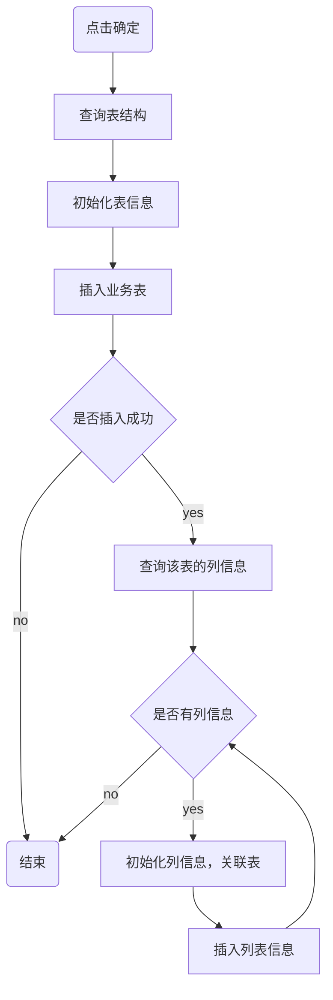

# 原理篇之代码生成器

代码生成器，是提高开发效率的重要工具，它主要分为两个部分：

第一部分：将业务表结构，导入到系统中，在这里，开发者可以预览、编辑、删除和同步业务表结构，实现对业务表的全面管理。

第二部分：是在选择了特定的表之后，点击生成按钮，系统将根据表结构，生成相应的前后端代码，并提供下载。


## 一、数据库表结构说明

若依提供了两张核心表，来存储导入的业务表信息：

- `gen_table` 表：存储业务表的基本信息，它对应于配置代码“基本信息”和“生成信息”的页面；
- `gen_table_column` 表：存储业务表的字段信息     它对应于配置代码“字段信息”的页面。

这两张表是一对多的关系，一张业务表可以有多个字段的信息，所以在字段信息表中有个外键 `table_id` 指向业务表中的 `table_id` 字段


## 二、项目结构说明

### 2.1.后端项目说明

dkd-generator

├─📁 src
│ └─📁 main
│   ├─📁 java
│   │ └─📁 com
│   │   └─📁 dkd
│   │     └─📁 generator
│   │       ├─📁 config-------- # 读取代码生成相关配置
│   │       ├─📁 controller
│   │       ├─📁 domain
│   │       ├─📁 mapper
│   │       ├─📁 service
│   │       └─📁 util---------- # Velocity 模板工具类
│   └─📁 resources
│     ├─📁 mapper
│     │ └─📁 generator
│     ├─📁 vm
│     └─📄 generator.yml

### 2.2.前端项目结构

├─📁 bin
├─📁 html
├─📁 public
├─📁 src
│ ├─📁 api
│ │ ├─📁 manage
│ │ ├─📁 monitor
│ │ ├─📁 system
│ │ ├─📁 tool
│ │ │ └─📄 gen.js----------------- # Api 请求 Js 文件
│ │ ├─📄 login.js
│ │ ├─📄 menu.js
│ │ └─📄 page.js
│ ├─📁 assets
│ ├─📁 components
│ ├─📁 directive
│ ├─📁 layout
│ ├─📁 plugins
│ ├─📁 router
│ ├─📁 store
│ ├─📁 utils
│ ├─📁 views
│ │ ├─📁 error
│ │ ├─📁 home
│ │ ├─📁 manage
│ │ ├─📁 monitor
│ │ ├─📁 redirect
│ │ ├─📁 system
│ │ ├─📁 tool
│ │ │ ├─📁 build
│ │ │ ├─📁 gen
│ │ │ │ ├─📄 basicInfoForm.vue---- # 基本信息视图组件
│ │ │ │ ├─📄 editTable.vue-------- # 字段信息视图组件
│ │ │ │ ├─📄 genInfoForm.vue------ # 生成信息视图组件
│ │ │ │ ├─📄 importTable.vue------ # 导入对话框
│ │ │ │ └─📄 index.vue------------ # 代码生成视图组建
│ │ │ └─📁 swagger
│ │ ├─📄 login.vue
│ │ └─📄 register.vue
│ ├─📄 App.vue
│ ├─📄 main.js
│ ├─📄 permission.js
│ └─📄 settings.js
├─📁 vite
├─……

## 三、源码分析

### 3.1.导入表结构

当管理员在界面上点击导入按钮时，会弹出一个对话框；

此时，前端需要向后端发送请求，查询数据库并返回到前端，展示当前项目库中所有待导入的业务表。


此功能涉及前端相关的代码位于`views/tool/gen/index.vue`这个视图组件中，负责实现导入业务表的用户界面和交互逻辑。

src/views/tool/gen/index.vue

```javascript
/** 打开导入表弹窗 */
function openImportTable() {
  proxy.$refs["importRef"].show();
}
```

后端处理逻辑，则在代码生成模块（`dkd-generator`）的`GenController`中，负责接收前端的请求，处理业务逻辑，并返回查询结果。

dkd-generator/src/main/java/com/dkd/generator/controller/GenController.java

```java
/**
 * 查询数据库列表
 */
@PreAuthorize("@ss.hasPermi('tool:gen:list')")
@GetMapping("/db/list")
public TableDataInfo dataList(GenTable genTable) {
    startPage();
    List<GenTable> list = genTableService.selectDbTableList(genTable);
    return getDataTable(list);
}
```

XML 语句如下：

dkd-generator/src/main/resources/mapper/generator/GenTableMapper.xml

```xml
<select id="selectDbTableList" parameterType="GenTable" resultMap="GenTableResult">
    <!-- 查询数据库表列表，排除特定前缀的表，并且不在 gen_table 中的表 -->
    select table_name, table_comment, create_time, update_time from information_schema.tables
    where table_schema = (select database())
    AND table_name NOT LIKE 'qrtz_%' AND table_name NOT LIKE 'gen_%'
    AND table_name NOT IN (select table_name from gen_table)
    <if test="tableName != null and tableName != ''">
       <!-- 根据表名模糊查询 -->
       AND lower(table_name) like lower(concat('%', #{tableName}, '%'))
    </if>
    <if test="tableComment != null and tableComment != ''">
       <!-- 根据表注释模糊查询 -->
       AND lower(table_comment) like lower(concat('%', #{tableComment}, '%'))
    </if>
    <if test="params.beginTime != null and params.beginTime != ''"><!-- 开始时间检索 -->
       <!-- 根据开始时间过滤表 -->
       AND date_format(create_time,'%y%m%d') &gt;= date_format(#{params.beginTime},'%y%m%d')
    </if>
    <if test="params.endTime != null and params.endTime != ''"><!-- 结束时间检索 -->
       <!-- 根据结束时间过滤表 -->
       AND date_format(create_time,'%y%m%d') &lt;= date_format(#{params.endTime},'%y%m%d')
    </if>
       order by create_time desc
</select>
```

当管理员在对话框中，选中需要导入的业务表，点击确定按钮，

此时，前端需要向后端发送请求，保存业务表的基本信息和字段信息

此功能，涉及前端相关的代码，负责实现导入业务表功能的用户界面和交互逻辑。

src/views/tool/gen/importTable.vue

```javascript
/** 导入按钮操作 */
function handleImportTable() {
  const tableNames = tables.value.join(",");
  if (tableNames == "") {
    proxy.$modal.msgError("请选择要导入的表");
    return;
  }
  importTable({ tables: tableNames }).then(res => {
    proxy.$modal.msgSuccess(res.msg);
    if (res.code === 200) {
      visible.value = false;
      emit("ok");
    }
  });
}
```

后端处理逻辑，则在代码生成模块的`GenController`中，负责接收前端的请求，处理业务逻辑，保存业务表的基本信息和字段信息

dkd-generator/src/main/java/com/dkd/generator/controller/GenController.java

```java
/**
 * 导入表结构（保存）
 */
@PreAuthorize("@ss.hasPermi('tool:gen:import')")
@Log(title = "代码生成", businessType = BusinessType.IMPORT)
@PostMapping("/importTable")
public AjaxResult importTableSave(String tables) {
    String[] tableNames = Convert.toStrArray(tables);
    // 查询表信息
    List<GenTable> tableList = genTableService.selectDbTableListByNames(tableNames);
    // 导入表结构（保存）
    genTableService.importGenTable(tableList, SecurityUtils.getUsername());
    return success();
}
```

具体的执行的流程如下图：

