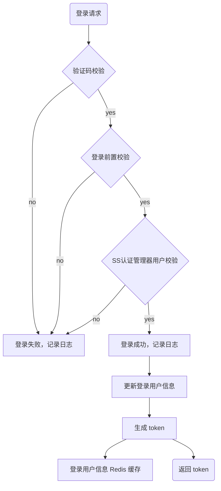
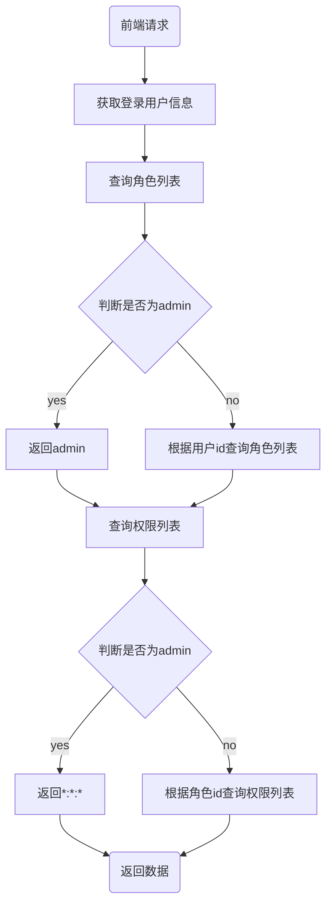
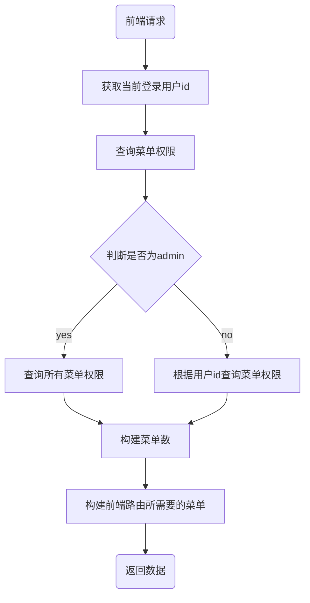

# 原理篇之RBAC权限控制

## 一、Spring Security

Spring Security 是一个功能强大的 Java 安全框架，它提供了全面的安全**认证**和**授权**支持。

与 RBAC 模型结合使用时，Spring Security 能够实现灵活的权限控制。

- **认证（Authentication）**：在 Spring Security 的世界里，认证就像用户登录时，提交的用户名和密码，系统通过这些信息，来验证“你是谁”。
  - Spring Security不仅支持传统的用户名和密码认证，还支持OAuth2、JWT等现代认证方式。
- **授权（Authorization）**：在 Spring Security 中，授权是确认用户在通过认证之后，是否有权限执行某些操作或访问特定资源。

### 1.1.Spring Security 配置

Spring Security 的配置类，是实现安全控制的核心部分。

在配置类中，可以开启 Spring Security 的各种功能，包括认证、授权、会话管理、过滤器添加等等，以确保 Web 应用程序的安全性。

dkd-framework/src/main/java/com/dkd/framework/config/SecurityConfig.java

```java
@EnableGlobalMethodSecurity(prePostEnabled = true, securedEnabled = true) // 开启方法级别的权限控制 => @PreAutherize
public class SecurityConfig extends WebSecurityConfigurerAdapter {
  ……
}
```

## 二、用户登录流程

管理员在登录页面，输入用户名、密码、验证码后，点击登录按钮，向后端发送请求，后端通过 SpringSecurity 认证管理器进行登录校验。

此功能涉及：

- 前端相关的代码，位于 `views/login.vue` 这个视图组件中，负责实现用户登录界面和交互逻辑。
- 后端处理逻辑，则在 `dkd-admin` 模块的 `SysLoginController` 中，负责接收前端的请求，处理登录逻辑，并返回 token 令牌

### 2.1.前端部分

1. 点击 `login.vue` 中的登录按钮

2. 调用 `login.vue` 中的 `handleLogin` 方法

3. 调用 `store/mondles/user.js` 中的 `login` 方法，将返回结果存入 `useUserStore` 对象中（用于管理用户相关的状态和操作）。

4. 调用 `api/login.js`中的 `login` 方法

5. 调用 `utils/request.js` 中的 `service` 实例基于 axios 发送 ajax 请求（.env.development 文件设置了统一请求路径前缀）

### 2.2.后段部份

#### 2.2.1.SysLoginController

在 `ruoyi-admin` 模块中 `com.ruoyi.web.controller.system.SysLoginController` 类的 `login` 方法，接收前端登录请求。

#### 2.2.2.SysLoginService

在 `ruoyi-framework` 模块中 `com.ruoyi.framework.web.service.SysLoginService` 类的 `login` 方法处理登录逻辑：

1. 验证码校验；
2. 登录前置校验；
3. SS 认证管理器用户校验，调用执行 `UserDetailsServiceImpl.loadUserByUsername` 方法
   1. 认证通过后，创建登录用户对象 LoginUser，包括用户ID、部门ID、用户信息和用户权限信息；
4. 登录成功，记录日志；
5. 修改用户表更新登录信息；
6. 生成 token。

具体的执行的流程如下图：



> 在配置文件 application.yml 中，定义了 token 的相关信息，注意其中的 secret 要保管好。
>
> dkd-admin/src/main/resources/application.yml
>
> ```yaml
> # token配置
> token:
>   # 令牌自定义标识
>   header: Authorization
>   # 令牌密钥
>   secret: xxxxxx
>   # 令牌有效期（默认30分钟）
>   expireTime: 30
> ```

## 三、用户的角色和权限

### 3.1.前端部分

1. 在全局 `permission.js` 中的 `router.beforeEach` 方法，用于在用户导航到不同路由之前，进行一些预处理。
2. 调用 `store/mondles/user.js` 中的 `getInfo` 方法，将返回结果存入 `useUserStore` 对象中（用于管理用户相关的状态和操作）。
3. 调用 `api/login.js` 中的 `getInfo` 方法

### 3.2.后端部分

#### 3.2.1.SysLoginController

在 `ruoyi-admin` 模块中 `com.ruoyi.web.controller.system.SysLoginController` 类的 `getInfo` 方法，接收前端获取用户信息请求。

#### 3.2.2.SysPermissionService

在 `ruoyi-framework` 模块中 `com.ruoyi.framework.web.service.SysPermissionService` 类

1. `getRolePermission` 方法，查询该用户角色集合；
2. `getMenuPermission` 方法，查询该用户权限（菜单）集合。

具体的执行的流程如下图：



## 四、页面权限

前端封装了一个指令权限，能简单快速的实现按钮级别的权限判断。

**使用权限字符串 v-hasPermi**：`@/directive/permission/hasPermi.js`

```html
<!-- 单个 -->
<el-button v-hasPermi="['system:user:add']">存在权限字符串才能看到</el-button>
<!-- 多个 -->
<el-button v-hasPermi="['system:user:add', 'system:user:edit']">包含权限字符串才能看到</el-button>
```

**使用角色字符串 v-hasRole**`@/directive/permission/hasRole.js`

```html
<!-- 单个 -->
<el-button v-hasRole="['admin']">管理员才能看到</el-button>
<!-- 多个 -->
<el-button v-hasRole="['role1', 'role2']">包含角色才能看到</el-button>
```

## 五、菜单获取

用户登录系统时，看到的侧边栏菜单，根据他的角色权限而有所不同。而超级管理员，是可以查看所有菜单的。

- 实现此功能的前端代码，位于 `src/permission.js` 文件。它在登录成功后，会在跳转到新路由之前，去查询当前用户有权访问的动态菜单的路由列表。
- 后端处理逻辑，则在 `ruoyi-admin` 模块的 `SysLoginController` 中，它负责接收前端发来的请求，处理查询，并构建起一个完整的菜单树结构，然后返回给前端。

> 若依中的菜单层级如下：
>
> ```mermaid
> graph LR
> A[主类目] -->B[工单管理（目录菜单）]
>     A --> C[点位管理（目录菜单）]
>     C --> D[区域管理（组件菜单）]
>     C --> E[点位管理（组件菜单）]
>     C --> F[合作商管理（组件菜单）]
> ```

### 5.1.前端部分

1. 在全局 `permission.js` 中的 `router.beforeEach` 方法，用于在用户导航到不同路由之前进行一些预处理；
2. 调用 `store/mondles/permission.js` 中的 `generateRoutes` 方法，将返回结果存入 `usePermissionStore` 对象中。
3. 调用 `api/menu.js` 中的 `getRouters` 方法

### 5.2.后段部分

#### 5.2.1.SysLoginController

在 `ruoyi-admin` 模块中 `com.ruoyi.web.controller.system.SysLoginController` 类的 `getRouters` 方法，接收前端获取路由信息请求。

#### 5.2.2.ISysMenuService

在 `ruoyi-system` 模块中 `com.ruoyi.web.system.service.ISysMenuService` 类：

1. `selectMenuTreeByUserId` 方法，根据用户ID，查询菜单树信息（递归生成父子菜单）。
2. `buildMenus` 方法，构建前端路由所需要的菜单路由格式 `RouterVo`

具体的执行的流程如下图：



## 六、动态路由加载

1. 用户登录成功后，通过路由 `router/index.js` 跳转到首页，并加载 layout 布局组件。
2. 在 `layout/index.vue` 中加载 sidbar 侧边栏；
3. 在 `layout/components/Sidebar/index.vue` 中，遍历动态路由菜单在页面显示；
4. 用户点击菜单后，会根据路由的 path，跳转到对应的视图组件在 `<app-main />` 显示