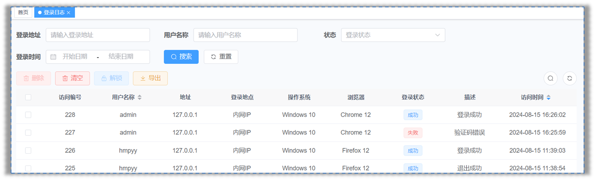

# 原理篇之异步任务管理器、操作日志

## 一、异步任务管理器

若依框架的前后端分离版本中，异步任务管理器，扮演着重要角色；

主要用于处理一些不需要即时返回结果的后台任务，从而提高应用程序的整体性能。

使用场景：记录日志



使用异步任务管理器，能够提高性能呢，举例如下：

用户在浏览器中输入用户名、密码和验证码，然后发送登录请求。

在 sysLoginService 业务层代码中，实现登录逻辑，核心业务是登录认证，包括验证码校验、用户名查询和密码校验。

- 如果校验失败，会记录日志并返回提示信息；
- 如果校验成功，同样记录日志并返回 token。

假设登录认证核心业务代码执行耗时 50ms，记录日志也需要耗时 50ms，那么整个登录请求耗时就是100ms。

现在，如果产品经理根据客户的要求，增加了一个功能：在后台系统登录成功后，给用户发送一条提示短信。

这意味着我们需要在业务层增加发送短信的代码，而这同样需要耗时 50ms。

这样一来，整个登录请求的耗时就变成了150ms，用户的等待时间增加了，系统性能也随之下降。

此外，我们的登录业务还涉及到事务控制，以保证业务的一致性。

- 如果登录认证业务成功，但记录日志时出现异常，导致事务回滚，这样的设计显然是不合理的。这就是**级联失败**的现象。

其实对于用户只关心登录是否成功，而对于记录日志和发送短信这些非核心业务，他们并不关心是否立即完成。


因此，我们可以通过异步任务管理器的多线程，来处理这些任务。我们来看下

在用户发送登录请求时，`SysLoginService`业务层只需关注登录认证的核心业务代码。

记录日志和发送短信的任务，可以交给异步管理器来处理。

这样，用户登录的耗时只需要 50ms，无需等待异步任务的完成，从而显著提高了性能。

更重要的是，登录认证作为一个独立的事务运行在主线程中，而记录日志则在另一个线程中进行。

这样，即使记录日志失败，也不会影响登录认证的事务，实现了故障隔离。


所以，可以将那些不需要立即返回结果的非核心业务代码，交给异步任务管理器来执行，从而优化系统性能，提高用户体验。

具体流程图如下：


### 1.1.源码位置

若依异步任务管理器，是一个单例对象使用了线程池+异步工厂（产生任务用）

- com.ruoyi.framework.manager.AsyncManager 异步任务管理器
- com.ruoyi.framework.manager.factory.AsyncFactory 异步线程工厂

下方代码是异步任务管理器的使用示例：

```java
// 多线程执行任务AsyncManager.me().execute(AsyncFactory.createTimerTask());
AsyncManager.me().execute(AsyncFactory.createTimerTask());
```

1. `AsyncManager.me()` 获取 `AsyncManager` 对象；
2. 调用 `execute` 方法，执行 `TimerTask` 任务（记录登录日志），它实现了 `runnable` 接口，由线程 `Thread` 去执行。
3. `execute` 方法内部，调用 `ScheduledExecutorService` 异步操作任务调度线程池的 schedule 方法，用于延迟 10 毫秒执行一个任务

## 二、操作日志

在日常编程中，记录日志是不可或缺的，尤其在处理关键业务时，它能帮助我们追踪和审查操作过程。

在若依项目中，在需要被记录日志的 Controller 控制器类的方法上，添加 `@Log` 注解，使用方法如下：

```java
@Log(title = "订单管理", businessType = BusinessType.INSERT)
public AjaxResult add(...) {
    return toAjax(...);
}
```

`@Log` 注解的参数说明：

| 参数               | 类型         | 默认值 | 描述                                                         |
| ------------------ | ------------ | ------ | ------------------------------------------------------------ |
| title              | String       | 空     | 操作模块                                                     |
| businessType       | BusinessType | OTHER  | 操作功能（`OTHER` 其他、`INSERT` 新增、`UPDATE` 修改、`DELETE` 删除、`GRANT` 授权、`EXPORT` 导出、`IMPORT` 导入、`FORCE` 强退、`GENCODE` 生成代码、`CLEAN` 清空数据） |
| operatorType       | OperatorType | MANAGE | 操作人类别（`OTHER` 其他、`MANAGE` 后台用户、`MOBILE` 手机端用户） |
| isSaveRequestData  | boolean      | true   | 是否保存请求的参数                                           |
| isSaveResponseData | boolean      | true   | 是否保存响应的参数                                           |
| excludeParamNames  | String[]     | {}     | 排除指定的请求参数                                           |

### 2.1.源码位置

若依操作日志，使用了【自定义注解 + AOP 切面 + 异步任务管理器】来实现

- com.ruoyi.common.annotation.Log  自定义注解。

- com.ruoyi.framework.aspectj.LogAspect  AOP 切面类

  - 通过实现 AOP 切面编程，对目标方法（标注 `@Log` 注解的方法）进行拦截，实现了操作日志的自动记录。
  - 异步任务管理器来将任务（记录操作日志到数据库）交给线程池来完成。

具体流程如下：

```mermaid
graph TD
A(请求) -->B[加了@Log注解的方法]
    B --> C(收集操作日志（操作人，系统模块，操作类型……)
    C --> D[记录日志]
    D --> E[异步线程工厂，生成任务（记录日志）]
    E --> F[异步任务管理器，由线程池执行任务]
    F -->|获取线程池对象| G[IOC容器（存放对象]
    E -->|获取操作日志业务层对象| G
```

