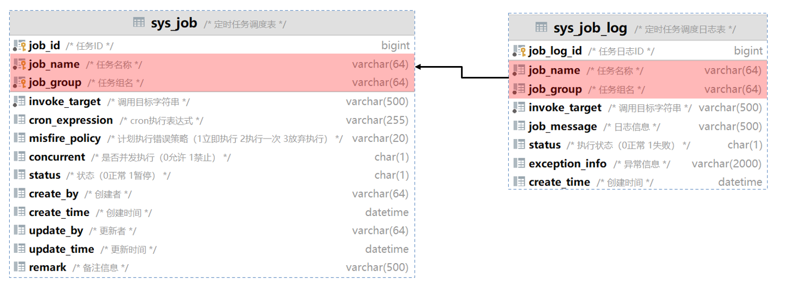
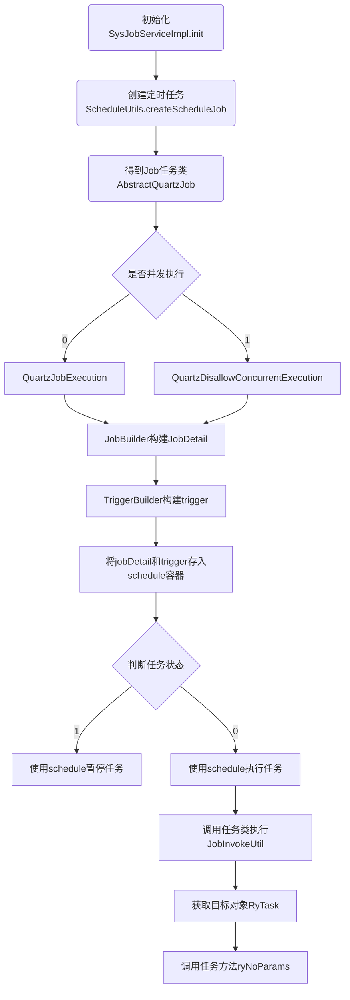

# 原理篇之定时任务

在 Web 应用项目开发中，定时任务是不可缺少的，

定时任务的场景非常广泛，

- 比如：某些视频网站，购买会员后，每天会给会员送成长值，每月会给会员送一些电影券；
- 比如：在保证最终一致性的场景中，往往利用定时任务调度，进行一些比对工作；
- 比如一些定时需要生成的报表、邮件；
- 比如一些需要定时清理数据的任务
- ……

若依提供了方便友好的 web 界面，可以达到动态控制定时任务启动、暂停、重启、删除、添加、修改等操作，极大地方便了开发过程。


## 一、数据库表结构说明

sys_job 表：这是核心的定时任务表，用于存储定时任务的配置信息，如任务名称、任务组、执行的类全名、执行的参数、cron 表达式等。

sys_job_log 表：用于记录定时任务的执行日志，包括任务的开始执行时间、结束执行时间、执行结果等。



## 二、项目结构说明

### 2.1.后端项目结构

dkd-quartz

```txt
├─📁 src
│ └─📁 main
│   ├─📁 java
│   │ └─📁 com
│   │   └─📁 dkd
│   │     └─📁 quartz
│   │       ├─📁 config-------- # 配置类
│   │       ├─📁 controller---- # 控制器类
│   │       ├─📁 domain-------- # 实体类
│   │       ├─📁 mapper-------- # Mapper 层
│   │       ├─📁 service------- # Service 层
│   │       ├─📁 task---------- # 任务类
│   │       └─📁 util---------- # 工具类
│   └─📁 resources
├─📁 target
└─📄 pom.xml
```

### 2.1.前端项目结构

```txt
├─📁 bin
├─📁 html
├─📁 public
├─📁 src
│ ├─📁 api
│ │ ├─📁 manage
│ │ ├─📁 monitor
│ │ │ ├─📄 cache.js
│ │ │ ├─📄 job.js----------- # API请求JS文件
│ │ │ ├─📄 jobLog.js-------- # API请求JS文件
│ │ │ ├─📄 logininfor.js
│ │ │ ├─📄 online.js
│ │ │ ├─📄 operlog.js
│ │ │ └─📄 server.js
│ │ ├─📁 system
│ │ ├─📁 tool
│ │ ├─📄 login.js
│ │ ├─📄 menu.js
│ │ └─📄 page.js
│ ├─📁 assets
│ ├─📁 components
│ ├─📁 directive
│ ├─📁 layout
│ ├─📁 plugins
│ ├─📁 router
│ ├─📁 store
│ ├─📁 utils
│ ├─📁 views
│ │ ├─📁 error
│ │ ├─📁 home
│ │ ├─📁 manage
│ │ ├─📁 monitor
│ │ │ ├─📁 cache
│ │ │ ├─📁 druid
│ │ │ ├─📁 job
│ │ │ │ ├─📄 index.vue------ # 视图组件
│ │ │ │ └─📄 log.vue-------- # 试图组件
│ │ │ ├─📁 logininfor
│ │ │ ├─📁 online
│ │ │ ├─📁 operlog
│ │ │ └─📁 server
│ │ ├─📁 redirect
│ │ ├─📁 system
│ │ ├─📁 tool
│ │ ├─📄 login.vue
│ │ └─📄 register.vue
│ ├─📄 App.vue
│ ├─📄 main.js
│ ├─📄 permission.js
│ └─📄 settings.js
├─📁 vite
├─📄 .env.development
├─📄 .env.production
├─📄 .env.staging
├─📄 .gitignore
├─📄 index.html
├─📄 LICENSE
├─📄 package.json
├─📄 pnpm-lock.yaml
├─📄 README.md
└─📄 vite.config.js
```

## 三、Quartz 体系结构

Quartz 体系结构如下：


| API                | 描述                                                         |
| ------------------ | ------------------------------------------------------------ |
| **Job**            | 实际要执行的任务类，必须实现 Quartz 的 `Job` 接口。          |
| **JobDetail**      | 代表一个`Job`实例，通过 `JobBuilder` 类创建。                |
| **JobBuilder**     | 用于声明一个任务实例，可以定义关于该任务的详情，如任务名、组名等。 |
| **Trigger**        | 触发器，用来触发并执行 `Job` 实例的机制。                    |
| **SimpleTrigger**  | 用于简单重复执行作业的触发器，例如：每隔一定时间执行一次。   |
| **CronTrigger**    | 使用 Cron 表达式定义执行计划的触发器，适用于定义复杂的执行时间。 |
| **TriggerBuilder** | 用于创建触发器`Trigger`实例的构建器。                        |
| **Scheduler**      | Quartz 中的核心组件，负责启动、停止、暂停和恢复任务。        |

定时任务调用的流程图如下：


