# 原理篇之定时任务

在 Web 应用项目开发中，定时任务是不可缺少的，

定时任务的场景非常广泛，

- 比如：某些视频网站，购买会员后，每天会给会员送成长值，每月会给会员送一些电影券；
- 比如：在保证最终一致性的场景中，往往利用定时任务调度，进行一些比对工作；
- 比如一些定时需要生成的报表、邮件；
- 比如一些需要定时清理数据的任务
- ……

若依提供了方便友好的 web 界面，可以达到动态控制定时任务启动、暂停、重启、删除、添加、修改等操作，极大地方便了开发过程。

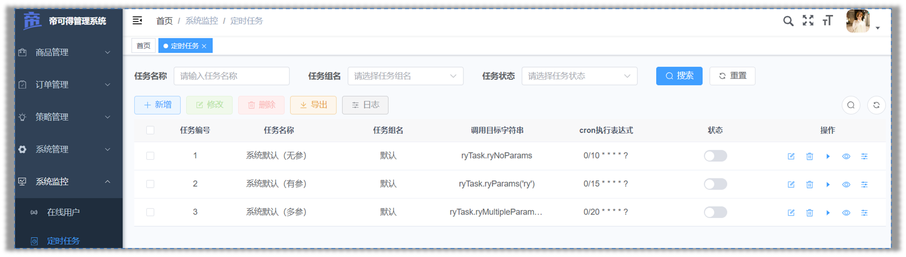

## 一、数据库表结构说明

`sys_job` 表：这是核心的定时任务表，用于存储定时任务的配置信息，如任务名称、任务组、执行的类全名、执行的参数、cron 表达式等。

`sys_job_log` 表：用于记录定时任务的执行日志，包括任务的开始执行时间、结束执行时间、执行结果等。

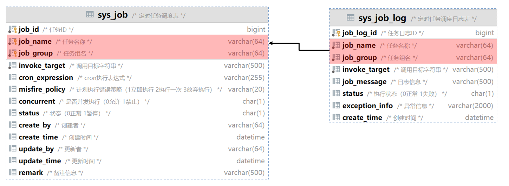

## 二、项目结构说明

### 2.1.后端项目结构

dkd-quartz

```txt
├─📁 src
│ └─📁 main
│   ├─📁 java
│   │ └─📁 com
│   │   └─📁 dkd
│   │     └─📁 quartz
│   │       ├─📁 config-------- # 配置类
│   │       ├─📁 controller---- # 控制器类
│   │       ├─📁 domain-------- # 实体类
│   │       ├─📁 mapper-------- # Mapper 层
│   │       ├─📁 service------- # Service 层
│   │       ├─📁 task---------- # 任务类
│   │       └─📁 util---------- # 工具类
│   └─📁 resources
├─📁 target
└─📄 pom.xml
```

### 2.1.前端项目结构

```txt
├─📁 bin
├─📁 html
├─📁 public
├─📁 src
│ ├─📁 api
│ │ ├─📁 manage
│ │ ├─📁 monitor
│ │ │ ├─📄 cache.js
│ │ │ ├─📄 job.js----------- # API请求JS文件
│ │ │ ├─📄 jobLog.js-------- # API请求JS文件
│ │ │ ├─📄 logininfor.js
│ │ │ ├─📄 online.js
│ │ │ ├─📄 operlog.js
│ │ │ └─📄 server.js
│ │ ├─📁 system
│ │ ├─📁 tool
│ │ ├─📄 login.js
│ │ ├─📄 menu.js
│ │ └─📄 page.js
│ ├─📁 assets
│ ├─📁 components
│ ├─📁 directive
│ ├─📁 layout
│ ├─📁 plugins
│ ├─📁 router
│ ├─📁 store
│ ├─📁 utils
│ ├─📁 views
│ │ ├─📁 error
│ │ ├─📁 home
│ │ ├─📁 manage
│ │ ├─📁 monitor
│ │ │ ├─📁 cache
│ │ │ ├─📁 druid
│ │ │ ├─📁 job
│ │ │ │ ├─📄 index.vue------ # 视图组件
│ │ │ │ └─📄 log.vue-------- # 试图组件
│ │ │ ├─📁 logininfor
│ │ │ ├─📁 online
│ │ │ ├─📁 operlog
│ │ │ └─📁 server
│ │ ├─📁 redirect
│ │ ├─📁 system
│ │ ├─📁 tool
│ │ ├─📄 login.vue
│ │ └─📄 register.vue
│ ├─📄 App.vue
│ ├─📄 main.js
│ ├─📄 permission.js
│ └─📄 settings.js
├─📁 vite
├─📄 .env.development
├─📄 .env.production
├─📄 .env.staging
├─📄 .gitignore
├─📄 index.html
├─📄 LICENSE
├─📄 package.json
├─📄 pnpm-lock.yaml
├─📄 README.md
└─📄 vite.config.js
```

## 三、Quartz 体系结构

Quartz 体系结构如下：

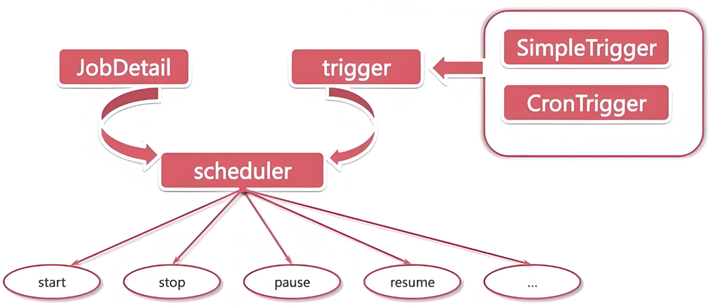

| API                | 描述                                                               |
| ------------------ | ------------------------------------------------------------------ |
| **Job**            | 实际要执行的任务类，必须实现 Quartz 的 `Job` 接口。                |
| **JobDetail**      | 代表一个`Job`实例，通过 `JobBuilder` 类创建。                      |
| **JobBuilder**     | 用于声明一个任务实例，可以定义关于该任务的详情，如任务名、组名等。 |
| **Trigger**        | 触发器，用来触发并执行 `Job` 实例的机制。                          |
| **SimpleTrigger**  | 用于简单重复执行作业的触发器，例如：每隔一定时间执行一次。         |
| **CronTrigger**    | 使用 Cron 表达式定义执行计划的触发器，适用于定义复杂的执行时间。   |
| **TriggerBuilder** | 用于创建触发器`Trigger`实例的构建器。                              |
| **Scheduler**      | Quartz 中的核心组件，负责启动、停止、暂停和恢复任务。              |

定时任务调用的流程图如下：

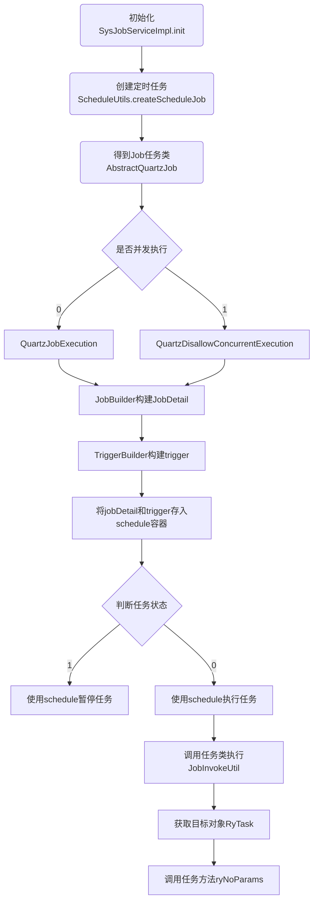
```mermaid
graph TD
A(初始化SysJobServiceImpl.init) --> B(创建定时任务ScheduleUtils.createScheduleJob)
    B --> C(得到Job任务类AbstractQuartzJob)
    C --> D{是否并发执行}
    D -->|0| E[QuartzJobExecution]
    D -->|1| F[QuartzDisallowConcurrentExecution]
    E --> G[JobBuilder构建JobDetail]
    F --> G
    G --> H[TriggerBuilder构建trigger]
    H --> I[将jobDetail和trigger存入schedule容器]
    I --> J{判断任务状态}
    J -->|1| K[使用schedule暂停任务]
    J -->|0| L[使用schedule执行任务]
    L --> M[调用任务类执行JobInvokeUtil]
    M --> N[获取目标对象RyTask]
    N --> O[调用任务方法ryNoParams]
```

## 四、新增定时任务

上文分析了在项目启动时，从数据库中查询任务配置列表，然后创建定时任务，并根据状态判断是否执行任务调度；

如果是新添加的定时任务，又该如何处理呢？下面对这部分的源码进行分析；

我们已经对若依前端的代码交互模式比较熟悉了，所以本次我们关注后端部分，入口在定时任务模块的 `SysJobController` 中：

dkd-quartz/src/main/java/com/dkd/quartz/controller/SysJobController.java

```java
/**
 * 新增定时任务
 */
@PreAuthorize("@ss.hasPermi('monitor:job:add')")
@Log(title = "定时任务", businessType = BusinessType.INSERT)
@PostMapping
public AjaxResult add(@RequestBody SysJob job) throws SchedulerException, TaskException {
    if (!CronUtils.isValid(job.getCronExpression())) {
        return error("新增任务'" + job.getJobName() + "'失败，Cron表达式不正确");
    } else if (StringUtils.containsIgnoreCase(job.getInvokeTarget(), Constants.LOOKUP_RMI)) {
        return error("新增任务'" + job.getJobName() + "'失败，目标字符串不允许'rmi'调用");
    } else if (StringUtils.containsAnyIgnoreCase(job.getInvokeTarget(), new String[]{Constants.LOOKUP_LDAP, Constants.LOOKUP_LDAPS})) {
        return error("新增任务'" + job.getJobName() + "'失败，目标字符串不允许'ldap(s)'调用");
    } else if (StringUtils.containsAnyIgnoreCase(job.getInvokeTarget(), new String[]{Constants.HTTP, Constants.HTTPS})) {
        return error("新增任务'" + job.getJobName() + "'失败，目标字符串不允许'http(s)'调用");
    } else if (StringUtils.containsAnyIgnoreCase(job.getInvokeTarget(), Constants.JOB_ERROR_STR)) {
        return error("新增任务'" + job.getJobName() + "'失败，目标字符串存在违规");
    } else if (!ScheduleUtils.whiteList(job.getInvokeTarget())) {
        return error("新增任务'" + job.getJobName() + "'失败，目标字符串不在白名单内");
    }
    job.setCreateBy(getUsername());
    return toAjax(jobService.insertJob(job));
}
```

具体流程图如下：

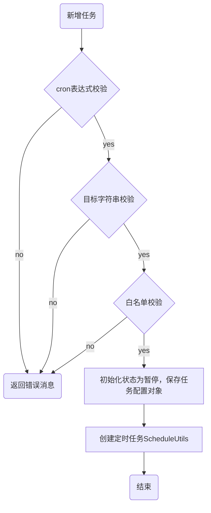
```mermaid
graph TD
  A(新增任务) --> B{cron表达式校验}
    B -->|yes| C{目标字符串校验}
    C -->|yes| D{白名单校验}
    B -->|no| H(返回错误消息)
    C -->|no| H
    D -->|no| H
    D -->|yes| E[初始化状态为暂停，保存任务配置对象]
    E --> F[创建定时任务ScheduleUtils]
    F --> G(结束)
```

## 五、修改定时任务状态

上文新增定时任务的源码时，发现了任务在初始化时是处于暂停状态的。

如果要启动任务，可以在页面进行任务状态的开关控制，接下来我们对此功能的源码进行分析，入口在：

dkd-quartz/src/main/java/com/dkd/quartz/controller/SysJobController.java

```java
/**
 * 定时任务状态修改
 */
@PreAuthorize("@ss.hasPermi('monitor:job:changeStatus')")
@Log(title = "定时任务", businessType = BusinessType.UPDATE)
@PutMapping("/changeStatus")
public AjaxResult changeStatus(@RequestBody SysJob job) throws SchedulerException {
    SysJob newJob = jobService.selectJobById(job.getJobId());
    newJob.setStatus(job.getStatus());
    return toAjax(jobService.changeStatus(newJob));
}
```

具体业务流程如下图所示：

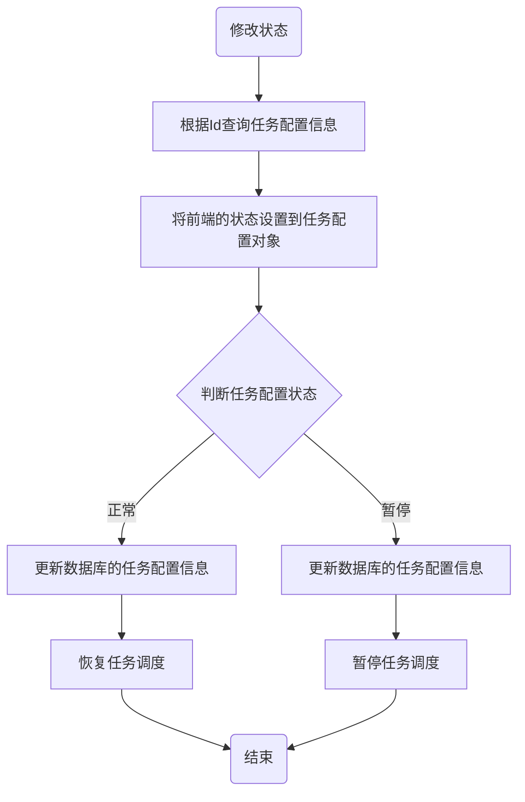
```mermaid
graph TD
  A(修改状态) --> B[根据Id查询任务配置信息]
    B --> C[将前端的状态设置到任务配置对象]
    C --> D{判断任务配置状态}
    D -->|正常| E[更新数据库的任务配置信息]
    E --> G[恢复任务调度]
    D -->|暂停| F[更新数据库的任务配置信息]
    F --> H[暂停任务调度]
    G --> I(结束)
    H --> I
```

## 六、Quartz 集群模式是什么

### 6.1.单点模式

为什么需要 Quartz 集群？

- 在单机模式下，默认所有的 jobDetail 和 trigger，都存储在内存中。
  - 好处是：读取速度快，
  - 缺点是：
    - 容易出现单点故障，一旦服务器故障，所有的任务数据都会丢失，这就是所谓的单点故障问题；
    - 负载压力大，比如在一个高峰时段，需要触发很多的任务，这将给服务器，带来巨大的负载压力。这不仅影响性能，还可能引发服务中断。

单点模式如下图所示：

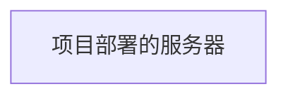
```mermaid
graph TD
 A[项目部署的服务器]
```

### 6.2.集群模式

为了解决以上问题，我们可以部署多个服务器节点，将任务信息存储到数据库中。

这样，多个节点就可以通过共享数据库，来协调任务的执行，形成 **Quartz 集群模式**。

这种方式，不仅解决了单点故障问题，还能通过负载均衡提升效率。

集群模式的优势：

- **高可用性**：即使某个节点出现问题，其他节点仍然可以正常运行。
- **负载均衡**：将任务分散到不同的节点执行，避免单个节点过载。

通常在生产环境中，我们会部署多台服务器，所以采用集群模式，不会产生额外的成本。

集群模式如下图所示：

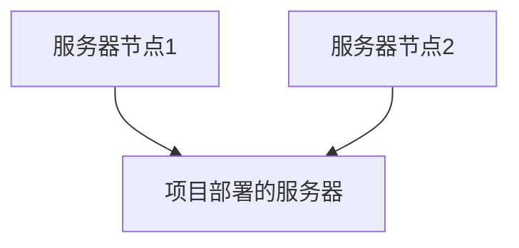
```mermaid
graph TD
  A[服务器节点1]
  B[服务器节点2]
  A --> C[项目部署的服务器]
  B --> C
```

Quartz 集群模式，相关数据库表：

| 表名                       | 用途                                                   |
| -------------------------- | ------------------------------------------------------ |
| `qrtz_triggers`            | 存储触发器的基本信息，比如触发器名称、组、类型等。     |
| `qrtz_cron_triggers`       | 存储 Cron 触发器的额外信息，比如 Cron 表达式。         |
| `qrtz_simple_triggers`     | 存储简单触发器的额外信息，比如重复次数和间隔。         |
| `qrtz_blob_triggers`       | 存储 BLOB 类型触发器的额外信息，比如持久化的数据。     |
| `qrtz_simprop_triggers`    | 存储具有单一触发器属性的触发器的详细信息。             |
| `qrtz_job_details`         | 存储作业详细信息，比如作业名称、组、描述、作业类名等。 |
| `qrtz_scheduler_state`     | 存储调度器的状态信息，比如当前主节点信息等。           |
| `qrtz_locks`               | 存储锁信息，用于控制并发和防止资源冲突。               |
| `qrtz_paused_trigger_grps` | 存储被暂停的触发器组的信息。                           |
| `qrtz_fired_triggers`      | 存储已触发的触发器的详细信息，包括执行历史。           |
| `qrtz_calendars`           | 存储日历信息，定义工作日和非工作日，用于调度时间约束。 |

## 七、Quartz 集群模式的实现

实现集群模式，有如下步骤：

### 7.1.SQL 导入

导入 SQL：将若依提供的 quartz.sql 导入到数据库中。

sql/

```txt
├─📄 quartz.sql--------- # 导入该文件
└─📄 ry_20240629.sql
```

### 7.2.配置开启

打开被注释的配置类

dkd-quartz/src/main/java/com/dkd/quartz/config/ScheduleConfig.java

```java
package com.dkd.quartz.config;

import org.springframework.context.annotation.Bean;
import org.springframework.context.annotation.Configuration;
import org.springframework.scheduling.quartz.SchedulerFactoryBean;

import javax.sql.DataSource;
import java.util.Properties;

/**
 * 定时任务配置（单机部署建议删除此类和qrtz数据库表，默认走内存会最高效）
 *
 * @author ruoyi
 */
@Configuration
public class ScheduleConfig {
    @Bean
    public SchedulerFactoryBean schedulerFactoryBean(DataSource dataSource) {
        // 创建SchedulerFactoryBean实例
        SchedulerFactoryBean factory = new SchedulerFactoryBean();
        // 设置数据源
        factory.setDataSource(dataSource);

        // quartz参数
        Properties prop = new Properties();
        // 设置调度器实例名称，在同一个集群内多个节点上，该实例名称必须一致
        prop.put("org.quartz.scheduler.instanceName", "RuoyiScheduler");
        // 设置调度器实例ID生成方式，在同一个集群内多个节点上，该id必须唯一
        prop.put("org.quartz.scheduler.instanceId", "AUTO");

        // 线程池配置
        // 设置线程池类
        prop.put("org.quartz.threadPool.class", "org.quartz.simpl.SimpleThreadPool");
        // 设置线程数量
        prop.put("org.quartz.threadPool.threadCount", "20");
        // 设置线程优先级
        prop.put("org.quartz.threadPool.threadPriority", "5");

        // JobStore配置
        // 设置JobStore类
        prop.put("org.quartz.jobStore.class", "org.springframework.scheduling.quartz.LocalDataSourceJobStore");
        // 集群配置
        // 设置是否启用集群
        prop.put("org.quartz.jobStore.isClustered", "true");
        // 设置集群检查间隔
        prop.put("org.quartz.jobStore.clusterCheckinInterval", "15000");
        // 设置每次处理的最大错误触发器数量
        prop.put("org.quartz.jobStore.maxMisfiresToHandleAtATime", "10");
        // 设置事务隔离级别为可序列化
        prop.put("org.quartz.jobStore.txIsolationLevelSerializable", "true");

        // sqlserver 启用
        // 用于SQL Server的锁定SQL语句配置
        // prop.put("org.quartz.jobStore.selectWithLockSQL", "SELECT * FROM {0}LOCKS UPDLOCK WHERE LOCK_NAME = ?");
        // 设置错误触发器阈值
        prop.put("org.quartz.jobStore.misfireThreshold", "12000");
        // 设置表前缀
        prop.put("org.quartz.jobStore.tablePrefix", "QRTZ_");
        // 设置Quartz属性
        factory.setQuartzProperties(prop);

        // 设置调度器名称
        factory.setSchedulerName("RuoyiScheduler");
        // 延时启动，单位为秒
        factory.setStartupDelay(1);
        // 设置Spring应用上下文在SchedulerContext中的键
        factory.setApplicationContextSchedulerContextKey("applicationContextKey");
        // 可选，QuartzScheduler
        // 启动时更新己存在的Job，这样就不用每次修改targetObject后删除qrtz_job_details表对应记录了
        factory.setOverwriteExistingJobs(true);
        // 设置自动启动，默认为true
        factory.setAutoStartup(true);

        // 返回配置好的SchedulerFactoryBean实例
        return factory;
    }
}

```

### 7.3.节点复制

首先，修改当前 Spring Boot 的启动类的名称为 `DkdApplication1`。

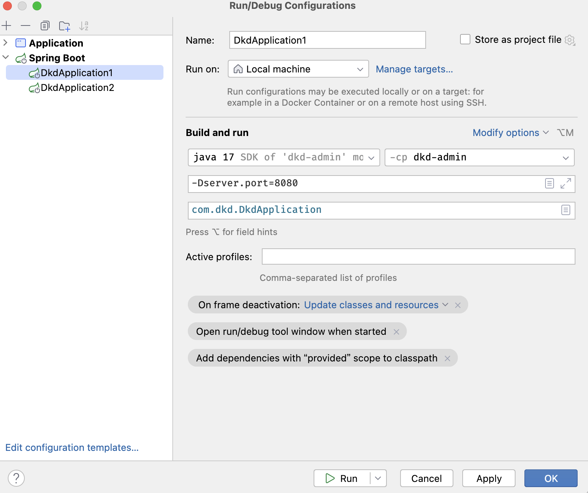

再由 `DkdApplication1` 复制得到一个 Spring Boot 的启动配置，取名为 `DkdApplication2`

- 使用 Java 系统属性（`-Dserver.port=8081`），配置该节点的服务端口号为 `8081`。

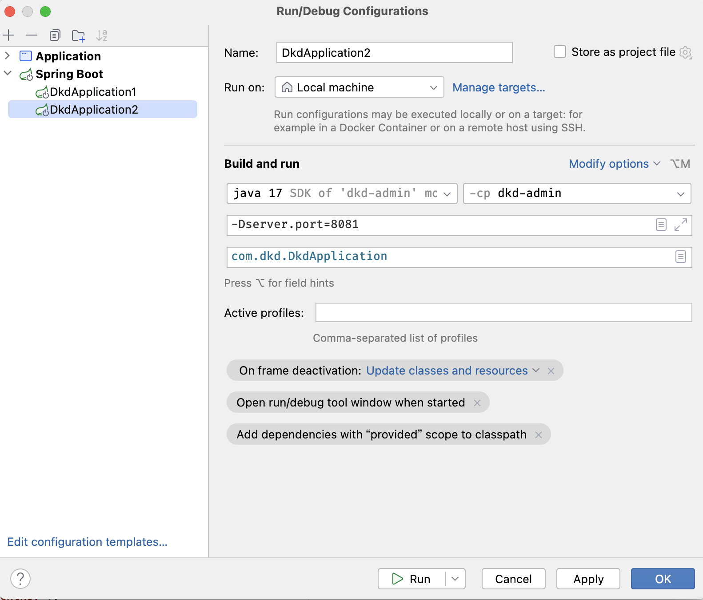

重启项目即可，观察数据库，已存入 jobDetail 和 trigger，多个服务器节点可以实现共享。

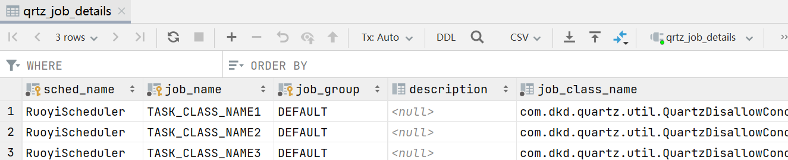

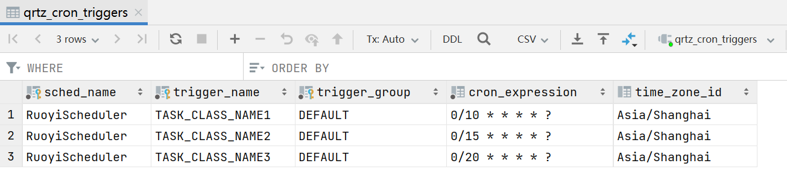

多个服务器节点，不会出现任务重复执行的问题。
