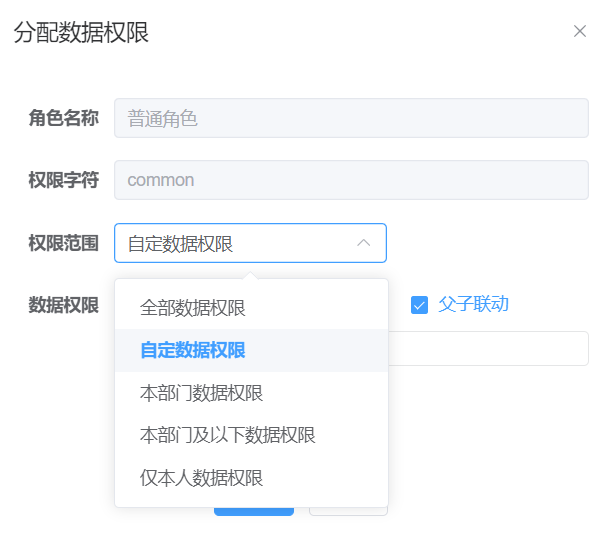
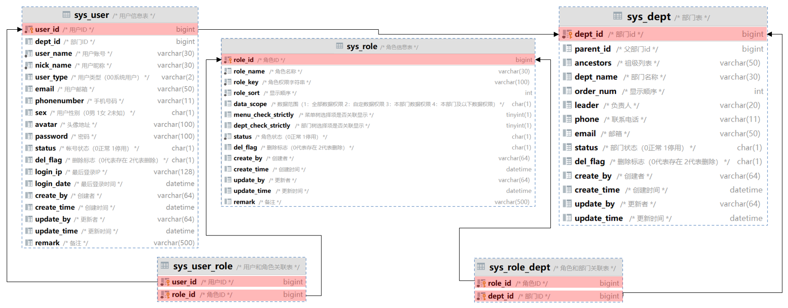
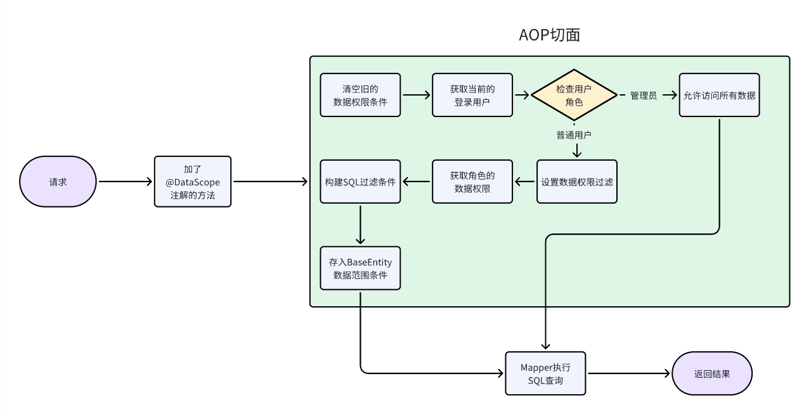
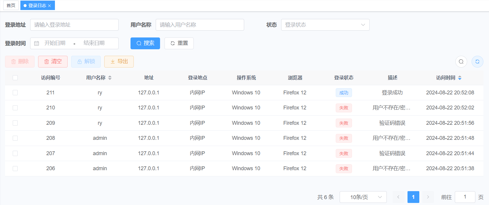

# 原理篇之数据权限

如何确保用户只能访问他们被授权查看的数据？答案就是：数据权限控制。

想象一下，有一个大型集团公司，旗下有多个子公司和部门。

每个部门，比如市场部或财务部，都有自己的敏感数据。

我们不希望一个部门的员工，能够访问另一个部门的敏感信息，

数据权限的场景：

1. **部门级权限**：市场部的员工，应该只能访问到销售相关的数据，确保他们只能触及**自己部门**的信息。
2. **公司级权限**：子公司的经理，需要查看整个子公司的数据，以做出战略决策。
3. **跨部门权限**：公司的高级领导或特定角色，需要有更全面的数据访问权限，以便跨部门或跨公司地进行管理和决策。

通过数据权限控制，我们不仅保护了公司的数据安全，还确保了数据的合理利用和流程的顺畅。

## 一、数据权限演示

在若依系统中，权限的分配和控制，主要依赖于角色。

每个角色，可以被赋予不同的**菜单权限**和**数据权限**，

用户则通过他们的**角色**，来继承这些权限，进而决定他们能访问哪些系统资源。

目前，系统支持以下五种数据权限类型：

- **全部数据权限**：无限制访问所有数据，相当于拥有最高权限的通行证。
- **自定义数据权限**：根据自己的需求，设定访问特定数据的规则。
- **部门数据权限**：只能访问自己所在部门的数据，限制在本部门范围内。
- **部门及以下数据权限**：可以访问自己部门及下属部门的数据，适用于管理层级。
- **仅本人数据权限**：只能访问和操作自己的数据，保障个人隐私和数据隔离。



> 提示：
>
> - 默认系统管理员 `admin`，拥有所有数据权限 `（userId=1）`；
> - 默认角色，拥有所有数据权限（如需要开启数据权限控制，则要设置数据权限）。

## 二、数据权限表结构

若依的数据权限设计，主要通过用户、角色、部门表建立关系，实现对数据的访问控制：



## 三、数据权限源码

### 3.1.@DataScope 注解

在需要数据权限控制的方法上，添加 `@DataScope` 注解，其中 `d` 和 `u` 用来表示表的别名。

部门数据权限注解

dkd-system/src/main/java/com/dkd/system/service/impl/SysRoleServiceImpl.java

```java
/**
 * 根据条件分页查询角色数据
 *
 * @param role 角色信息
 * @return 角色数据集合信息
 */
@Override
@DataScope(deptAlias = "d")
public List<SysRole> selectRoleList(SysRole role) {
    return roleMapper.selectRoleList(role);
}
```

部门及用户权限注解

- “自定义数据权限”，一定要这么写。

dkd-system/src/main/java/com/dkd/system/service/impl/SysUserServiceImpl.java

```java
/**
 * 根据条件分页查询用户列表
 *
 * @param user 用户信息
 * @return 用户信息集合信息
 */
@Override
@DataScope(deptAlias = "d", userAlias = "u")
public List<SysUser> selectUserList(SysUser user) {
    return userMapper.selectUserList(user);
}
```

| 参数      | 类型   | 默认值 | 描述         |
| --------- | ------ | ------ | ------------ |
| deptAlias | String | 空     | 部门表的别名 |
| userAlias | String | 空     | 用户表的别名 |

### 3.2.MyBatis 查询 ${params.dataScope}

在 `mybatis` 查询底部标签，添加数据范围过滤：

```xml
<select id="select" parameterType="..." resultMap="...Result">
    <include refid="select...Vo"/>
    <!-- 数据范围过滤 -->
    ${params.dataScope}
</select>
```

其作用，相当于在一个 `SELECT` 语句后面，拼接一个 `AND` 条件语句，来实现查询限制，如下所示：

未过滤的情况：

```mysql
-- 用户管理（未过滤数据权限的情况）：
select u.user_id, u.dept_id,  u.user_name, u.email
  , u.phonenumber, u.password, u.sex, u.avatar
  , u.status, u.del_flag, u.login_ip, u.login_date, u.create_by
  , u.create_time, u.remark, d.dept_name
from sys_user u
  left join sys_dept d on u.dept_id = d.dept_id
where u.del_flag = '0';
```

过滤的情况：

```mysql
-- 用户管理（已过滤数据权限的情况）：
select u.user_id, u.dept_id,  u.user_name, u.email
  , u.phonenumber, u.password, u.sex, u.avatar
  , u.status, u.del_flag, u.login_ip, u.login_date, u.create_by
  , u.create_time, u.remark, d.dept_name
from sys_user u
  left join sys_dept d on u.dept_id = d.dept_id
where u.del_flag = '0'
  and u.dept_id in (
        select dept_id
        from sys_role_dept
        where role_id = 2
    );
```

结果很明显，多了如下子句。通过角色部门表（`sys_role_dept`）完成了自定义类型的数据权限过滤

```mysql
and u.dept_id in (
  select dept_id
  from sys_role_dept
  where role_id = 2
)
```

### 3.3.数据权限实现要求

1.在 Service 层方法上加 `@DataScope` 注解。

2.在 MyBatis 的 XML 映射文件里的 SQL 语句末尾，加 `${params.dataScope}` 实现数据范围过滤。

3.同时要求：

1. 实现数据权限的实体类，需要继承 `BaseEntity` 类。
2. 实现数据权限的实体类，业务表，需要有 `dept_id` 和 `user_id` 这两个字段。

### 3.4.数据权限源码和流程

若依数据权限底层，使用了自定义注解 + AOP 切面 + SQL 拼接

- com.dkd.common.annotation.DataScope 自定义注解；
- com.ruoyi.framework.aspectj.DataScopeAspect：切面类；
  - 通过实现 AOP 编程，对目标方法进行拦截（标注 DataScope 注解的方法），实现了构建数据范围 SQL 过滤条件。



## 四、数据权限应用

需求：我们有一个系统登录日志，里面记录了所有用户的登录信息。

但是，并不是所有人，都应该看到所有的日志数据。所以，我们需要根据用户的角色，来控制他们能查看的数据范围。



### 4.1.添加权限注解

在 Service 层的 `SysLogininforServiceImpl` 实现类里的 `selectLogininforList` 方法上，加上 `@DataScope(deptAlias = "d", userAlias = "u")` 注解。

dkd-system/src/main/java/com/dkd/system/service/impl/SysLogininforServiceImpl.java

```java
/**
 * 查询系统登录日志集合
 *
 * @param logininfor 访问日志对象
 * @return 登录记录集合
 */
@DataScope(deptAlias = "d", userAlias = "u")
@Override
public List<SysLogininfor> selectLogininforList(SysLogininfor logininfor) {
    return logininforMapper.selectLogininforList(logininfor);
}
```

### 4.2.添加表字段

如果 `sys_logininfo` 业务表，需要实现数据权限，需要有 `dept_id` 和 `user_id` 这两个字段。

使用 SQL 语句活图形化工具添加这两个字段，并添加外键约束。

```mysql
ALTER TABLE sys_logininfor ADD COLUMN `dept_id` BIGINT DEFAULT NULL COMMENT '部门ID';
ALTER TABLE sys_logininfor ADD COLUMN `user_id` BIGINT DEFAULT NULL COMMENT '用户ID';
```

### 4.3.添加实体类属性

在 `dkd-system` 模块的 `SysLogininfor` 实体类中，需要有 `deptId` 和 `userId` 这两个属性。

dkd-system/src/main/java/com/dkd/system/domain/SysLogininfor.java

```java
public class SysLogininfor extends BaseEntity {
    ……

    private Long userId;

    private Long deptId;

    public Long getUserId() {
        return userId;
    }

    public void setUserId(Long userId) {
        this.userId = userId;
    }

    public Long getDeptId() {
        return deptId;
    }

    public void setDeptId(Long deptId) {
        this.deptId = deptId;
    }
    ……
}
```

### 4.4.修改 XML 映射文件

在 `dkd-system` 模块的 `SysLogininforMapper.xml` 映射文件中，通过动态拼接 SQL，实现数据范围的过滤。

- 在 INSERT 语句中，拼接上 `user_id`、`dept_id` 字段。
- 在 SELECT 语句中，查询 dept_id、user_id 两字段，加入左连接，关联 sys_dept、sys_user 两张表。
- 在 SELECT 语句的 WHERE 语句中，拼接上 `{params.dataScope}`，

dkd-system/src/main/resources/mapper/system/SysLogininforMapper.xml

```xml
<insert id="insertLogininfor" parameterType="SysLogininfor">
    insert into sys_logininfor (user_name, status, ipaddr, login_location, browser, os, msg, login_time, user_id, dept_id)
    values (#{userName}, #{status}, #{ipaddr}, #{loginLocation}, #{browser}, #{os}, #{msg}, sysdate(), #{userId}, #{deptId})
</insert>

<select id="selectLogininforList" parameterType="SysLogininfor" resultMap="SysLogininforResult">
       select l.info_id, l.user_name, l.ipaddr, l.login_location, l.browser, l.os, l.status, l.msg, l.login_time
       from sys_logininfor l
       LEFT JOIN sys_dept d on d.dept_id = l.dept_id
       LEFT JOIN sys_user u ON u.user_id = l.user_id
       <where>
           <if test="ipaddr != null and ipaddr != ''">
               AND ipaddr like concat('%', #{ipaddr}, '%')
           </if>
           <if test="status != null and status != ''">
               AND status = #{status}
           </if>
           <if test="userName != null and userName != ''">
               AND user_name like concat('%', #{userName}, '%')
           </if>
           <if test="params.beginTime != null and params.beginTime != ''"><!-- 开始时间检索 -->
               AND login_time &gt;= #{params.beginTime}
           </if>
           <if test="params.endTime != null and params.endTime != ''"><!-- 结束时间检索 -->
               AND login_time &lt;= #{params.endTime}
           </if>
           # 数据范围修改
           ${params.dataScope}
       </where>
       order by info_id desc
   </select>
```

### 4.5.异步工厂调整

在 `dkd-framework` 模块的 `AsyncFactory` 异步工厂，创建登录日志任务时，需要设置 `deptId` 和 `userId` 两个属性。

dkd-framework/src/main/java/com/dkd/framework/manager/factory/AsyncFactory.java

```java
/**
 * 记录登录信息
 *
 * @param username 用户名
 * @param status   状态
 * @param message  消息
 * @param args     列表
 * @return 任务task
 */
public static TimerTask recordLogininfor(final String username, final String status, final String message,
                                         final Object... args) {
    final UserAgent userAgent = UserAgent.parseUserAgentString(ServletUtils.getRequest().getHeader("User-Agent"));
    final String ip = IpUtils.getIpAddr();
    return new TimerTask() {
        @Override
        public void run() {
            // ……

            // 设置登录用户的 id 和所属部门 id
            SysUser sysUser = SpringUtils.getBean(ISysUserService.class).selectUserByUserName(username);
            if (sysUser != null) {
                logininfor.setUserId(sysUser.getUserId());
                logininfor.setDeptId(sysUser.getDeptId());
            }

            // 插入数据
            SpringUtils.getBean(ISysLogininforService.class).insertLogininfor(logininfor);
        }
    };
}
```
